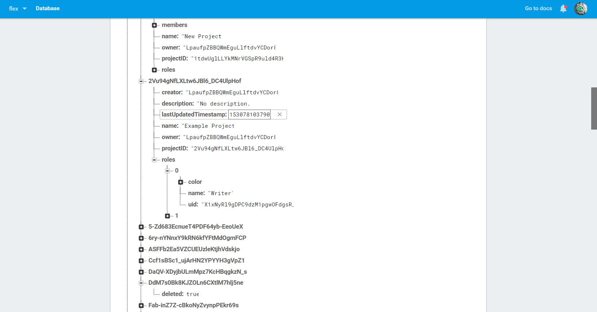
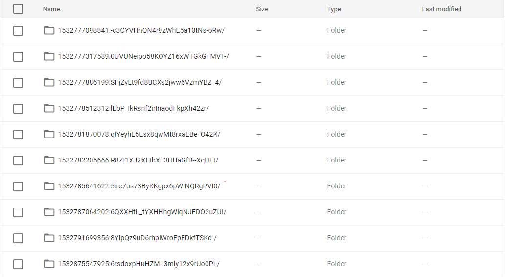
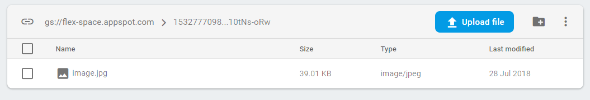
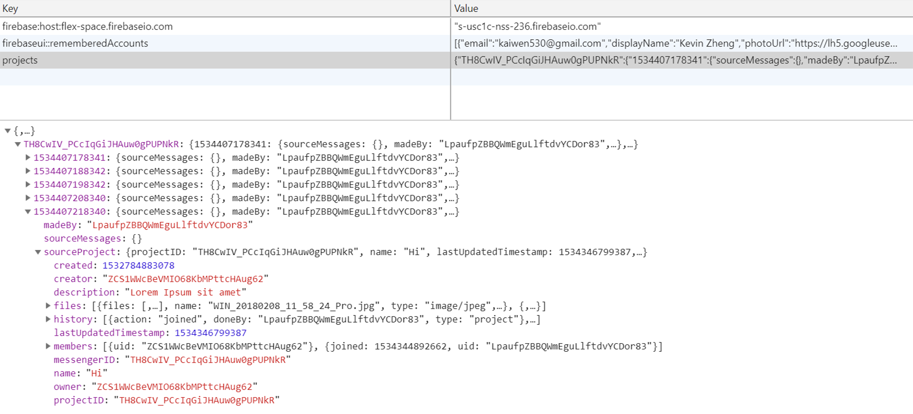

# File & Data Management

## Local

The file structure of the development environment is as follows.

The `src` folder contains all javascript and css source files.

- React components, or components that will appear visually on the application, are located in the `components` subfolder.

- CSS files that are relevant to a specific React component are named exactly the same as the file that contains it.

- Object classes are stored in the `classes` subfolder.

- Forms are stored in the `forms` subfolder. These are special React components that are designed to save or submit user-input data to a parent component.

- Individual pages of the application are stored in the `pages` subfolder.

The `public` folder contains any files that are directly accessible and will not be processed by the React compiler.

The `build` folder contains compiled code.

The deployed app is a copy of the resources in the build folder.

This structure is commonly used among React developers, and can be easily understood by a new developer if changes need to be made.

## Database & File storage

The application uses Firebase for database and file storage solutions.

- The NoSQL database stores all data including projects and users in the format of a JSON tree hierachy.

```json
"projects":{
    "79imVeTKyZ7JK3KiyIMTRLv4DHg6":{
        "name":"Example Project",
        "description":"Description"
        ...
    }
},
"users":{
    "TKyZ7JK3KiyIMTRLv4DHg679imVe":{
        "name":"James Doe",
        "email":"James.Doe@email.com"
        ...
    }
}
```

- Heres what it looks like in the Firebase Console:



- Requests are made to and from the database using the Firebase JS API. In essense, JSON data is transferred along with an operation and other metadata.

```json
"request":{
    "timstamp":1533223766621,
    "destination":"/projects/",
    "set":{
        "79imVeTKyZ7JK3KiyIMTRLv4DHg6":{
            "name":"Example Project",
            "description":"Description"
            ...
        }
    }
}
```

## Files

- Uploaded files are stored in file storage. A single file exists in each timestamp:uid named folder. All file metadata is stored in the database and correlated through a randomly generated uid.

```text
FileStorage
  \->1533223766621:TRLv4DHg679imVeTKyZ7JK3KiyIM
    \->image.png
  \->1533223839352:XoSSGuiozPqxrZG1vqhOmLkcxrn0
    \->document.docx
```

Here's how it looks like in the Firebase Console




## Security and Accessibility

- Users are authorised by Google via OAuth 2.0, the industry-standard protocol for authentication.

- All traffic is encrypted using SSL/TLS (Secure Socket Layer/Transport Layer Security), the industry standard for web traffic security.

### Database security and Accessibility

- Database operations are protected via security configurations that permits only authenticated users from making specific changes. e.g. Only invited users of a project can make changes to it.

```json
  "projects": {
      "$projectID": {
        ".write": "root.child('projects').child($projectID).child('permissions').child(auth.uid).val()===true || root.child('projects').child($projectID).child('owner').val()===auth.uid"
      }
  }
```

- These security rules are run on the server, and is (almost) impossible to bypass.

Data on firebase is always encrypted. Encryption is managed by Google.

- Most database operations are done through _transactions_, which guarantee that the operation can be performed on the latest version of the data, and can merge successfully with operations done at the same time by other users.

### File security and Accessibility

The file storage is configured so that while creating and manipulating files require athentication, fetching files do not. The timestamp:uid component of a file path enables security as a file can only be accessed if an individual can access the uid and timestamp of a file (e.g. The member of a project). This enables easy file sharing as long as an individual knows the link to it, while ensuring that outsiders can not directly access any files. This strategy, or a version of it, is used by many only services, including Discord, Google Docs etc.

Files that are hosted on Google Drive still have Google Drive's own sharing permissions.

## Backups

The users' projects and messages are fully backed up locally every 15 minutes.

Each backup records the user who has made the backup, the time it was backed up, the id of the backed up project, and the project itself.

Backup is again saved as a JSON hierarchy tree, with the following format

```json
{
  "projects": {
    "[projectID]": {
      "[timestamp]": {
        "madeBy": "[userID]",
        "sourceMessages": "[messages]",
        "sourceProject": "[project]"
      }
    }
  }
}
```

Backups are not visible by any other app or service except for Bonfire.

Here's what it looks like in Chrome Dev Tools.


