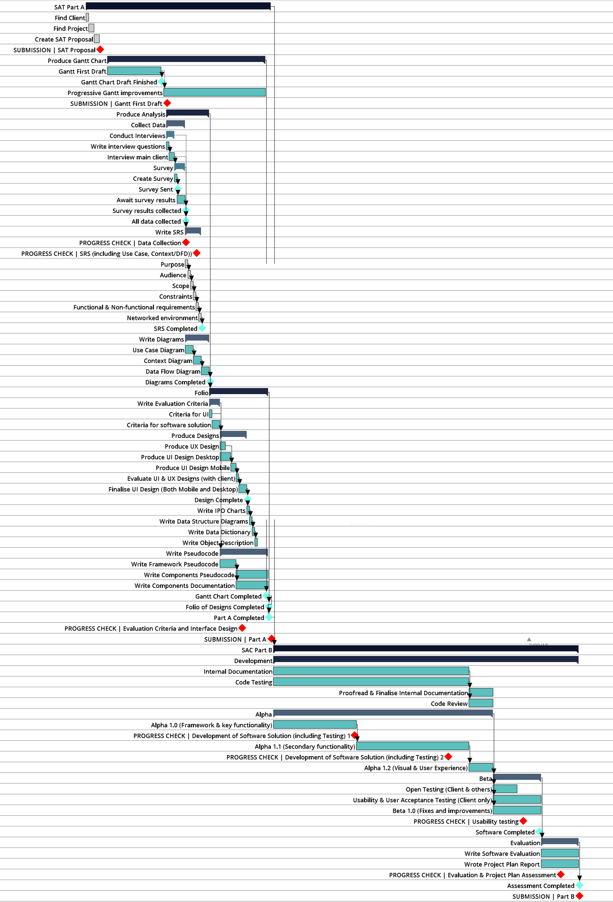
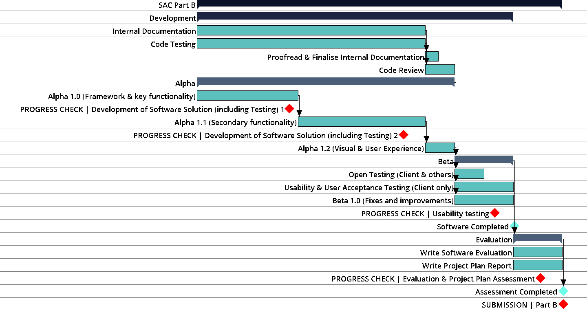
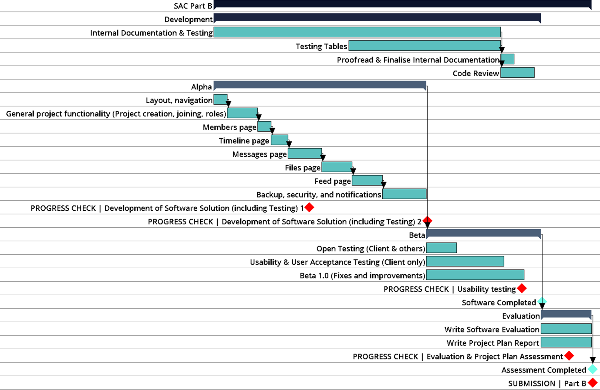
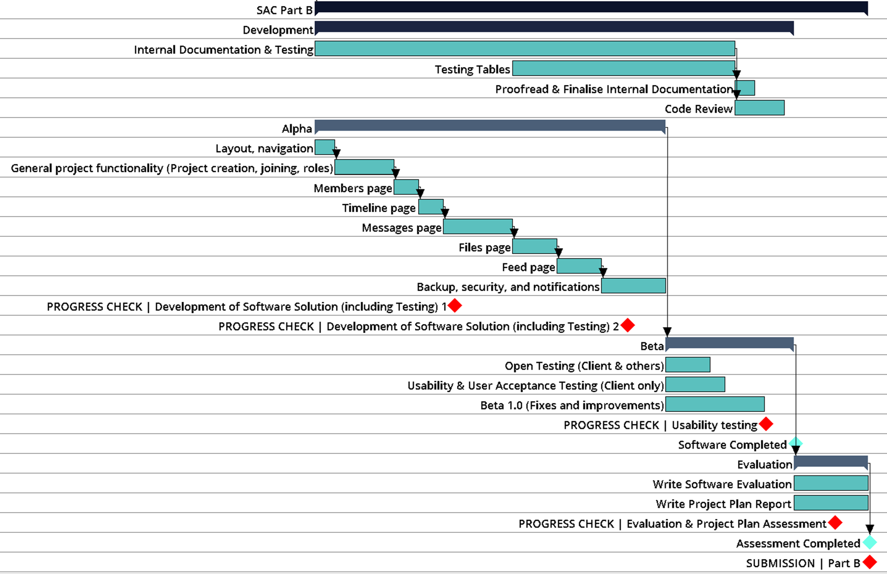
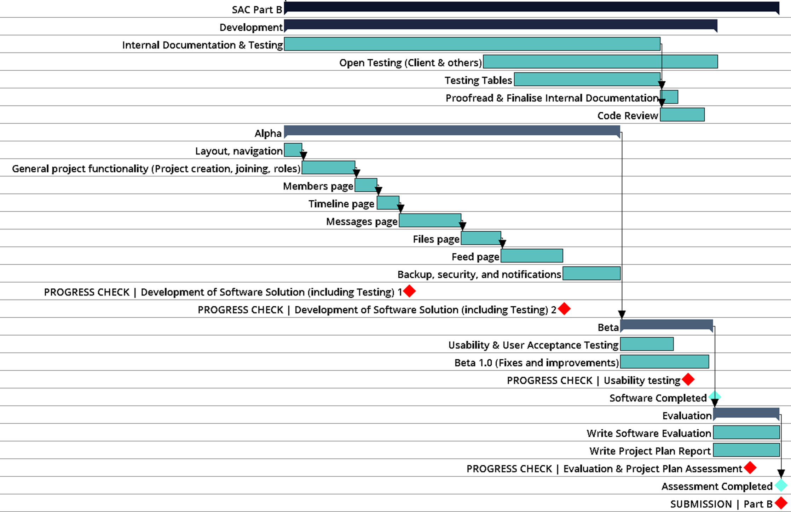
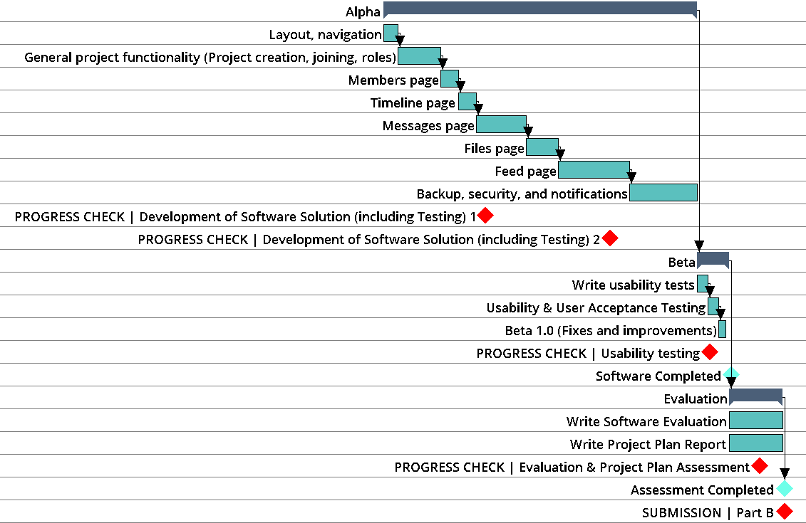
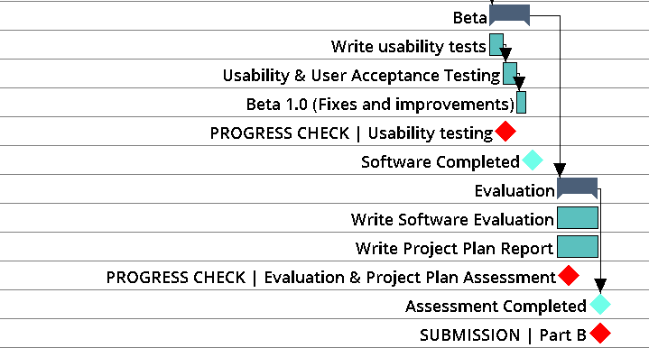

# Project Plan Evaluation

## Adjustments to the Project Plan

### Initial

[Download Gantt Chart Initial](./timelines/A0.gan)

### As submitted in part A _25/05/18_

[Download Gantt Chart Initial](./timelines/0.gan)

### Revision B1 _01/06/18_

[Download Gantt Chart Revision B1](./timelines/1.gan)

#### What Changed & Why

The initial items, which separated the app into primary and secondary functionality, did not look useful. Instead, this revision separated the app into several somewhat equal parts, to be completed over the same period of time.

Documentation and testing were extended. writing testing tables were delayed because it is realised that the software would change greatly over time, and some tests done previously may become irrelevant because the related component or feature would change or be removed, wasting time and effort.

#### Impact on Timeline

Overall, the project plan did not change greatly, in the sense that the schedules for completing alpha and beginning testing remained the same. However, the alpha stage of the app is more detailed, and is potentially more helpful to the planning of the project.

### Revision B2 _26/06/18_

[Download Gantt Chart Revision B2](./timelines/2.gan)

#### What Changed & Why

Revision 2 extended the time of alpha, and reduced the time for beta. This is due to a couple of reasons.

- After informally asking the client to explore the current state of the app, requested several new features that was not previously in the SRS. This included features such as:

  - Quoting, editing and deleting messages
  - Adding versions of a file manually
  - Assigning and editing the colours of roles

- It is felt that less time would be needed to test and evaluate the app. Dedicating more time to creating the app will result in it being higher quality.

#### Impact on Timeline

This change is not considered substantial. The time for app development has been slightly extended, while usability testing and usability evaluation has slightly been shortened. This did not however impact on internal documentation, informal testing, or project evaluation of the project.

### Revision B3 _15/07/18_

[Download Gantt Chart Revision B3](./timelines/3.gan)

#### What Changed & Why

Revision 3 moved open testing out of beta testing out of beta testing, instead is featured as an ongoing task. Clients and other users requested to test the app to give feedback. To accomodate for this, a decision was made to allow users to use the app starting from the 16th of July.

#### Impact on Timeline

The change to the timeline was not substantial. Moving open testing out of beta testing did not impact on any other aspects of the timeline.

### Revision B4 _28/08/18_

[Download Gantt Chart Revision B4](./timelines/4.gan)

#### What Changed & Why

The time assigned to beta was reduced dramatically. This is primarily due to the need to assign time to other subjects, which was considered when constructing the initial project plan, but to much lesser of an extent. As a result of this, the time assigned to completing the software has been extended, while the time for beta was reduced.

#### Impact on Timeline

The timeline was only impacted from the date onwards. Other than alpha and beta, the timeline was not impacted.

### Revision B5 _12/09/18_

[Download Gantt Chart Revision B5](./timelines/5.gan)

#### What Changed & Why

Revision 5 assigns less time to the evaluation aspect of the project. A multitude of school SACS and exams means less time is available to work on the project.

#### Impact on Timeline

Only the evaluation stage of the timeline was changed.

## A Review on the Usefulness of the Project Plan in Monitoring Progress

### Project & Scope

The project aimed to develop and test a project management app, for a client and related users, in order to run team projects more efficiently and effectively.  While the app is meant to unify a host of common project-management tools,  its scope is limited to only several core needs identified in the analysis stage, including time management, discussion, and file management. See the SRS for more information.

### Timeline Overview

The timeline divides the project into four stages - Analysis, Design, Development, and Evaluation.

Sub-tasks are scheduled under the aforementioned stages. In development, the tasks are separated into alpha and beta stage.

Overall, the project plan was somewhat, but not entirely useful, as a progress-monitoring tool.

The initial project plan was not useful. It did not give insight into what should be completed, especially during alpha, since primary and secondary functionality were not specific or defined. It was also difficult to predict exactly how much time needs to be assigned to each aspect of the project, detracting from its usefulness.

A major factor that contributed to the increased length of the alpha stage was the continual demands of additional features by the client, and other users. While the requested features were not considered unnecessary, it required time to implement these new features.

Although the stages in alpha were completed in the same order, they were not completed exactly as stated on the project plan. For example, some tasks were completed, to an extent, parallel to each other, since one part of the program relies on a certain functionality on another part, but the feature that was needed have not been implemented yet because it was not realised that it was needed. An example of this was implementing the mention feature. Using the mention feature on the files and feed page relies on the messages feature being able to prepare, send, and display message of that kind. This was, however, not implemented until work was started on the files / feed page.

Another key factor was that studying for other subjects took time away from developing the application. Many changes were made primarily to account for this factor, as evidenced by the shortening of beta and evaluation, and the extension of alpha.
