# Tests

## Test environment

Desktop: Chrome 67.0 / Windows 10 / Dell Latitude 3379

Mobile: Mobile Safari / iOS 9.3.2 / iPhone 5S

All tests are verified in both environments

## Important Notes

Variables and data structures used below are for demonstrative purposes only, and does not exactly match the source code - sometimes data irrelevant to a specific test in objects are omitted - to ensure clarity and understandability - but represents the original code to the greatest extent.

e.g. `btnState=loading` may actually be a button that is controlled by a property `state = { status: "loading" }` and have the code / behaviour `<Button loading={this.state.status==="loading" ? true : false} />`

Sometimes that value that is actually used in a test may be too absurd in some way to be written literally in the tables. Paraphrased values will be inclosed in the hash character. e.g. `# A string of 100 characters #`.

If data existed in an object but is not relevant to a test, they may be ommitted of represented by ellipsis. e.g. `user = { ... id:# Kevin Zheng's id #}`

Some syntax that will ensure the following tests are clear to read:

| Notation | Description                                                                            |
| -------- | -------------------------------------------------------------------------------------- |
| `{}`     | Empty object                                                                           |
| `[]`     | Empty array                                                                            |
| `""`     | Empty string                                                                           |
| `null`   | Any value that equals null, including null and undefined                               |
| `{x:y}`  | An object with a property named x with the value y                                     |
| `x=y`    | A variable named x with the value y, or the value y was assigned to a variable named x |

UI Elements have built-in input validation or intrinsic restrictions that prevent invalid data from being entered. The following will not be tested individually as it has been verified that it is impossible to enter invalid data of this kind:

| Type                 | Native Input Restrictions                                                                                                                                        |
| -------------------- | ---------------------------------------------------------------------------------------------------------------------------------------------------------------- |
| Text field           | Allow any UTF-8 Character, except characters that require a new line (line break, carriage return etc.). new line characters will be converted to a space (" "). |
| Multiline text field | Allow any UTF-8 Character.                                                                                                                                       |
| Date picker          | Follows the same restrictions as text field. Disallows any input that does not match the format yyyy-mm-dd.                                                      |
| File Open dialog     | Allow any file. Selection of folders or multiple files is disallowed.                                                                                            |
|                      |

## 0 General

> The Sign In functionality is provided by the Google OAuth API. When a user is signed in, data set in the browser's cookies and local storage, which can be used by this app to authenticate and identify a user.

> Note: In the latest version, the sign in mechanic changed, and no longer determines the sign in state using cookies and webstorage. Instead, the app watches the Firebase UI on animation frames. to make decisions on what to display.

| ID  | Element | Data                                                                           | Expected                                                           | Actual                                         | Fix |
| --- | ------- | ------------------------------------------------------------------------------ | ------------------------------------------------------------------ | ---------------------------------------------- | --- |
| 0.1 | Sign In | App loaded, no Google authentication data in cookies & web storage             | Do nothing                                                         | As expected                                    | -   |
| 0.2 | Sign In | Sign In button pressed, no Google authentication data in cookies & web storage | signIn.buttonState=loading, redirect to Google sign in             | As expected                                    | -   |
| 0.3 | Sign In | App loaded, Google authentication data in cookies & web storage                | signIn.buttonState=loading, Sign in visible=false, user page shown | As expected                                    | -   |
| 0.4 | Sign In | Firebase UI is loading.                                                        | `signInBtnState = loading`                                         | As expected                                    | -   |
| 0.5 | Sign In | Firebase UI is ready.                                                          | `signInBtnState = ready`                                           | As expected  | -   |
| 0.6 | Sign In | Firebase UI is ready. Sign in button pressed.                                  | Start sign in, `signInBtnState = loading`                          | As expected   | -   |
| 0.6 | Sign In | Firebase UI is loading. Sign in button pressed.                                | Do nothing                                                         | As expected                                    | -   |

## 1 Layout

| ID  | Element | Data                | Expected                                             | Actual                                               | Fix |
| --- | ------- | ------------------- | ---------------------------------------------------- | ---------------------------------------------------- | --- |
| 1.1 | Main    | `Window width=1599` | Sidebars collapsed, expand navigation button visible | As expected 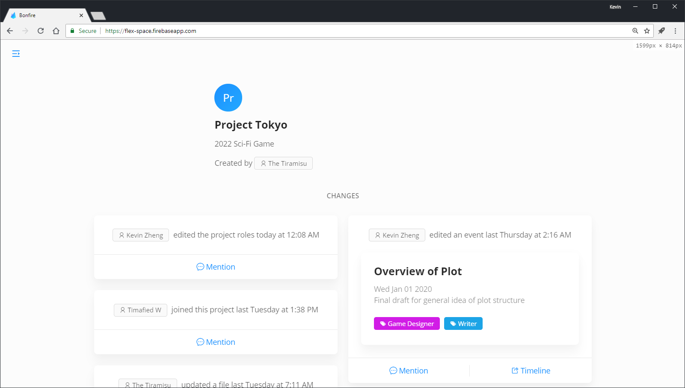 | -   |
| 1.2 | Main    | `Window width=1600` | Sidebars expanded, expand navigation button hidden   | As expected 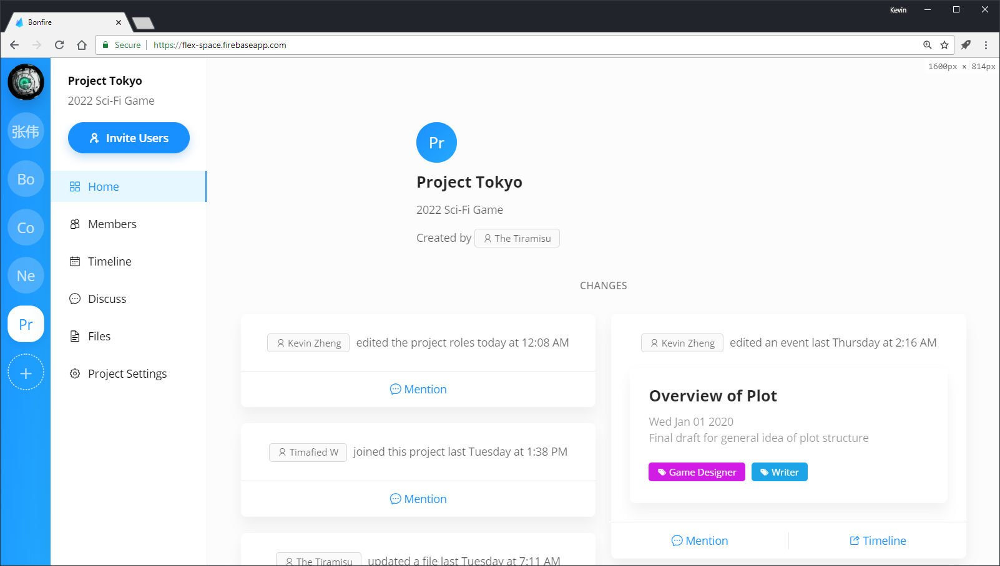      | -   |

## 2 Navigation

| ID  | Element                              | Data                                           | Expected                                                       | Actual                                      | Fix |
| --- | ------------------------------------ | ---------------------------------------------- | -------------------------------------------------------------- | ------------------------------------------- | --- |
| 2.1 | Project sidebar & In-project sidebar | Expand navigation selected, sidebars collapsed | Sidebars expanded                                              | As expected 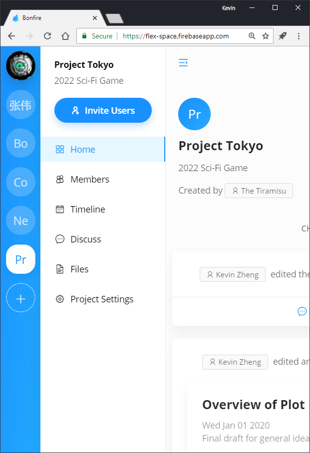 | -   |
| 2.2 | Project sidebar & In-project sidebar | Expand navigation selected, Sidebars expanded  | Sidebars collapsed                                             | As expected                                 | -   |
| 2.3 | Project sidebar                      | User icon selected                             | User icon highlighted, content switches to user page           | As expected                                 | -   |
| 2.4 | Project sidebar                      | Project icon selected                          | Project icon highlighted, content switches to selected project | As expected                                 | -   |
| 2.5 | In-project sidebar                   | Page item selected                             | Page item highlighted, content switches to selected page       | As expected                                 | -   |

## 3 High-level components

| ID   | Element                   | Data                                                                 | Expected                                                   | Actual                                                | Fix                                                                                                        |
| ---- | ------------------------- | -------------------------------------------------------------------- | ---------------------------------------------------------- | ----------------------------------------------------- | ---------------------------------------------------------------------------------------------------------- |
| 3.1  | Project name label        | `project=null`                                                       | show loading icon                                          | As expected                                           | -                                                                                                          |
| 3.2  | Project name label        | `project.name=null`                                                  | show loading icon                                          | As expected 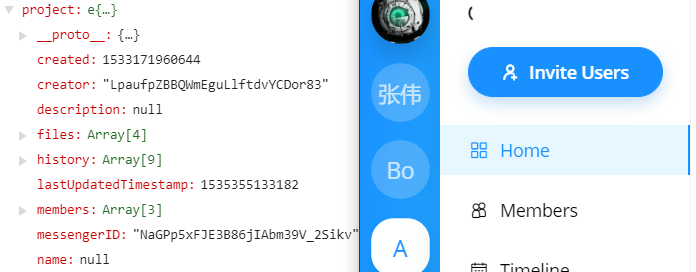 | -                                                                                                          |
| 3.3  | Project name label        | `project.name=""`                                                    | show "Untitled Project"                                    | loading icon shown                                    | Prevent project name from becoming an empty string by reverting to "Untitled Project" when a change occurs |
| 3.4  | Project name label        | `project.name="Example Title"`                                       | show "Example Title"                                       | As expected                                           | -                                                                                                          |
| 3.5  | Project name label        | `project.name="Really really long title that goes on forever"`       | show truncated title e.g. "A really long name th..."       | As expected 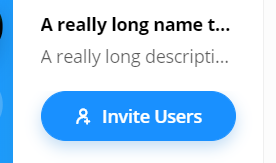         | -                                                                                                          |
| 3.6  | Project description label | `project=null`                                                       | show nothing                                               | As expected                                           | -                                                                                                          |
| 3.7  | Project description label | `project.description=null`                                           | show nothing                                               | As expected                                           | -                                                                                                          |
| 3.8  | Project description label | `project.description=""`                                             | show nothing                                               | As expected                                           | -                                                                                                          |
| 3.9  | Project description label | `project.description="Example Description"`                          | show "Example Description"                                 | As expected                                           | -                                                                                                          |
| 3.10 | Project description label | `project.name="Really really long description that goes on forever"` | show truncated description e.g. "A really long descrip..." | As expected 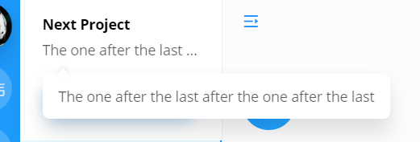   | -                                                                                                          |
| 3.11 | Project description label | `project.description!=null`, mouse hover                             | show tooltip of project.description                        | As expected (See above for screenshot)                | -                                                                                                          |
| 3.12 | Project description label | `project.description=null`, mouse hover                              | do nothing                                                 | As expected                                           | -                                                                                                          |
| 3.13 | Invite users button       | button pressed                                                       | display invite users modal                                 | As expected                                           | -                                                                                                          |

## 4 Pages

> Pages are displayed by the PageView component, which supplies each page with Project and User information, along with other functionalities.
> The user page is an exception and does not expect Project information to be supplied to it.

### 4.1 User Page

| ID    | Element | Data        | Expected                      | Actual                                  | Fix |
| ----- | ------- | ----------- | ----------------------------- | --------------------------------------- | --- |
| 4.1.1 | Page    | user = null | Display loading icon and text | As expected 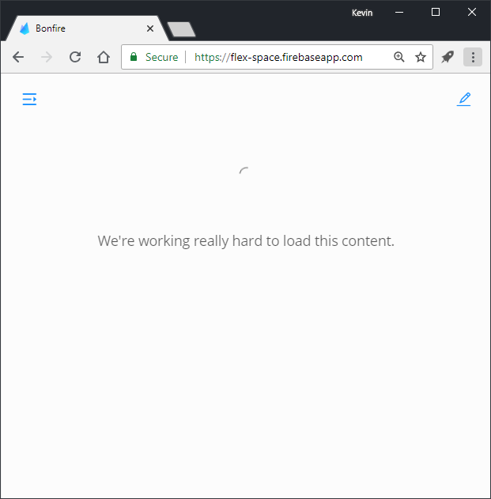 | -   |

## 5 Forms & Panels

### 5.1 Invite Users Panel

> The User Picker is a component that directly searches and returns registered users from the database based on their email using a search string.
> The component restricts user input to be plain text with no line breaks.

| ID    | Element             | Data                                                                                                   | Expected                                                              | Actual                                                      | Fix |
| ----- | ------------------- | ------------------------------------------------------------------------------------------------------ | --------------------------------------------------------------------- | ----------------------------------------------------------- | --- |
| 5.1.1 | User picker         | `input=""`                                                                                             | do nothing                                                            | As expected                                                 | -   |
| 5.1.2 | User picker         | `input="x"`, `database.users=["x@e.com","y@e.com"]`                                                    | suggest "x@e.com"                                                     | As expected                                                 | -   |
| 5.1.3 | User picker         | `input="x"`, `database.users=["x1@e.com","x2@e.com","y@e.com"]`                                        | suggest `["x1@e.com","x2@e.com"]`                                     | As expected 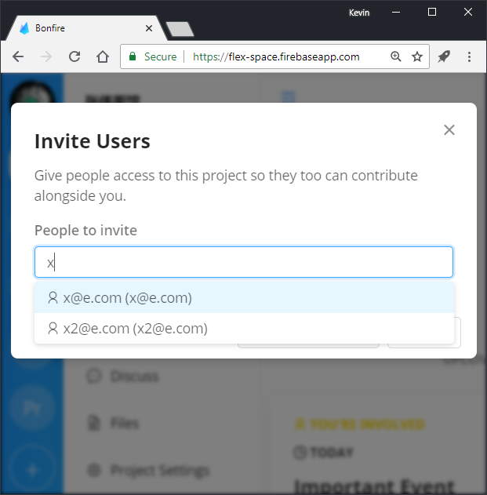                 | -   |
| 5.1.4 | User picker         | `input="x"` , `database.users=["x1@e.com","2x@e.com","y@x.com"]`                                       | suggest `"x1@e.com"`                                                  | As expected                                                 | -   |
| 5.1.5 | User picker         | `suggestedUsers=["x1@e.com"]`, pressed `"x1@e.com"`, `selectedUsers=[]`                                | `selectedUsers=["x1@e.com"]`                                          | As expected                                                 | -   |
| 5.1.6 | User picker         | `suggestedUsers=["x1@e.com","2x@e.com","y@x.com"]`, pressed `"x1@e.com"`, `selectedUsers=["2x@e.com"]` | `selectedUsers=["2x@e.com", "x1@e.com"]`                              | As expected                                                 | -   |
| 5.1.7 | Invite Users Button | `selectedUsers=[]`                                                                                     | disable button                                                        | As expected 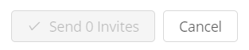 | -   |
| 5.1.8 | Invite Users Button | `selectedUsers=["x@e.com"]`                                                                            | enable button                                                         | As expected 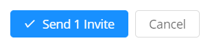  | -   |
| 5.1.9 | Invite Users Button | `selectedUsers=["x@e.com","2x@e.com","y@x.com"]`                                                       | request add users for `["x@e.com","2x@e.com","y@x.com"]`, close panel | As expected                                                 | -   |

### 5.2 Add Event

> For tests on limiting the length of the name and description fields, see 5.3.2, 5.3.3, 5.3.4, 5.3.5 as the same code is used.

| ID    | Element   | Data                                                                                                                                                                    | Expected                                                                                                                                     | Actual                                      | Fix |
| ----- | --------- | ----------------------------------------------------------------------------------------------------------------------------------------------------------------------- | -------------------------------------------------------------------------------------------------------------------------------------------- | ------------------------------------------- | --- |
| 5.2.1 | Add event | input data: `{name:"a", description:"b", "date":1533866631775 ,notify:1,autoComplete:false, involvedPeople: null}`, environment: `user.uid = # Kevin Zheng's user id #` | Event created with data `{... name:"a", description:"b",date:1533866631775,notify:1,autoComplete:false, creator: # Kevin Zheng's user id #}` | As expected                                 | -   |
| 5.2.2 | Add event | input data: `{}`, environment: `user.uid = # Kevin Zheng's user id #`                                                                                                   | Event created with data `{... name:"Untitled Event", description:null, creator: "Kevin Zheng's user id", date:# current date #}`             | As expected 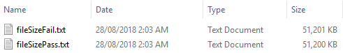 | -   |

### 5.3 Add Project

| ID    | Element     | Data                                                                                                       | Expected                                                                                                                                                | Actual                                               | Fix |
| ----- | ----------- | ---------------------------------------------------------------------------------------------------------- | ------------------------------------------------------------------------------------------------------------------------------------------------------- | ---------------------------------------------------- | --- |
| 5.3.1 | New Project | input data: `{name:null, description: null, invitePeople: null}`                                           | project created with `{name: "Untitled Project": description: null}`                                                                                    | As expected                                          | -   |
| 5.3.2 | New Project | input data: `{name: "Project", description: "Project Description", invitePeople: null}`                    | project created with `{name: "Project", description: "Project Description"}`                                                                            | As expected                                          | -   |
| 5.3.3 | New Project | input data: `{name: # String of 100 characters #, description: "Project Description", invitePeople: null}` | project created with `{name: # String of 100 characters #, description: "Project Description"}`                                                         | As expected                                          | -   |
| 5.3.4 | New Project | input data: `{name: # String of 101 characters #, description: "Project Description", invitePeople: null}` | project created with `{name: # String of 100 characters #, description: "Project Description"}`, final character trimmed.                               | As expected 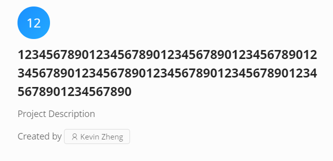 | -   |
| 5.3.5 | New Project | input data: `{name: " X ", description: "Project Description", invitePeople: null}`                        | project created with `{name: "X", description: "Project Description"}`                                                                                  | As expected                                          | -   |
| 5.3.6 | New Project | input data: `{name: "Project Name", description: # String of 2000 #, invitePeople: null}`                  | project created with `{name: "Project Name", description: # String of 2000 #}`                                                                          | As expected                                          | -   |
| 5.3.7 | New Project | input data: `{name: "Project Name", description: # String of 2001 #, invitePeople: null}`                  | project created with `{name: "Project Name", description: # String of 2000 #}`, final character trimmed 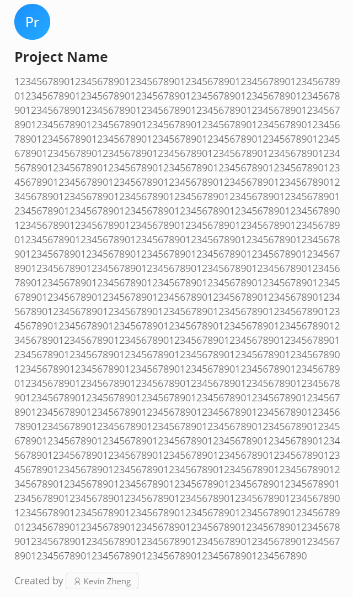 | As expected                                          | -   |

### 5.4 Add File

> Test files created with `fsutil file createnew <filename> <filesize>`
> For comment file length tests, see 5.3.3.

| ID    | Element        | Data                                     | Expected                                       | Actual                                                                        | Fix                                                                       |
| ----- | -------------- | ---------------------------------------- | ---------------------------------------------- | ----------------------------------------------------------------------------- | ------------------------------------------------------------------------- |
| 5.4.1 | Add File Panel | file: `{... size=52,428,800}`            | File allowed, show window to enter description | As expected   | -                                                                         |
| 5.4.2 | Add File Panel | file: `{... size=52,428,801}`            | File denied, show error                        | As expected 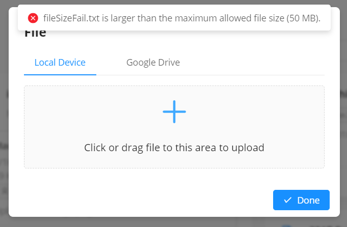                                | -                                                                         |
| 5.4.3 | Add File Panel | file: `{... size=0}`                     | File allowed, show window to enter description | As expected                                                                   | -                                                                         |
| 5.4.4 | Drag & Drop    | file: Empty folder                       | Folder denied                                  | Folder starts uploading, displays error.                                      | Add a check for when a folder is dropped into the upload zone. See below. |
| 5.4.5 | File Comment   | comment="", file: `{... name: test.txt}` | file.description = "Made Changes to test.txt"  | As expected                                                                   | -                                                                         |

```javascript
// Test if the file size is a multiple of 4096, since all folders have this property.
if (file.size % 4096 === 0) {
  let reader = new FileReader();
  // If the file has such a size, read the file to check if its a folder. This may take time, which is why the file size check is performed first.
  reader.onload = () => {
    // Otherwise, select the file, and go to the next step.
    this.setState({
      selectedFile: file,
      modalVisible: true,
      loading: false
    });
  };
  reader.onerror = () => {
    message.error("Unfortunately, we currently don't support uploading folders.");
  };
  reader.readAsText(file);
  return;
}
```

### S.5 Settings

#### 5.5.1 General Settings

#### 5.5.2 Roles

#### 5.5.3 Advanced

## 6 Data & Fetching

> Tests for adding and setting data to users and projects are avaible in Section 7

| ID  | Element         | Data                                                                                                | Expected                      | Actual      | Fix |
| --- | --------------- | --------------------------------------------------------------------------------------------------- | ----------------------------- | ----------- | --- |
| 6.1 | User Fetcher    | `userID=null`                                                                                       | return `null`                 | As expected | -   |
| 6.2 | User Fetcher    | `userID="x"`, `database.projects=[{... userID: "x"},{... userID:"y"},{... userID:"z"}]`             | return `{... userID: "x"}`    | As expected | -   |
| 6.3 | User Fetcher    | `userID="x"`, `database.projects=[{... userID: "a"},{... userID:"b"},{... userID:"c"}]`             | As expected                   | -           |
| 6.4 | Project Fetcher | `projectID=null`                                                                                    | return `null`                 | As expected | -   |
| 6.5 | Project Fetcher | `projectID="x"`, `database.projects=[{... projectID: "x"},{... projectID:"y"},{... projectID:"z"}]` | return `{... projectID: "x"}` | As expected | -   |
| 6.6 | Project Fetcher | `projectID="x"`, `database.projects=[{... projectID: "a"},{... projectID:"b"},{... projectID:"c"}]` | return `null`                 | As expected | -   |

## 7 Core Objects

### 7.1 Project

> For adding events to a project, see 5.2

### 7.2 User

> For texts related to creating a new project, see 5.3.
> For tests related to inviting users, see 5.1, as the one here uses the same logic. These tests will not be repeated.

### 7.3 Messenger / Messages

## 8 Utilities

### 8.1 Quicksort

### 8.2 Notifier

### 8.3 Backup

| ID  | Element | Data | Expected | Actual | Fix |
| --- | ------- | ---- | -------- | ------ | --- |

