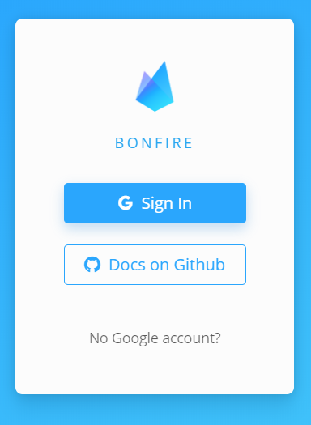
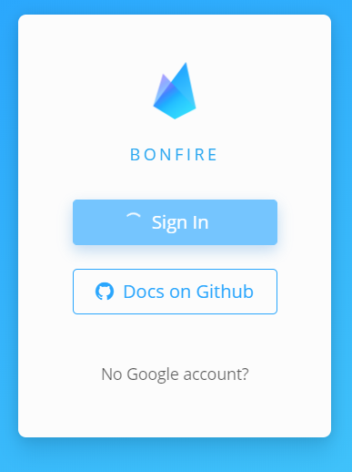
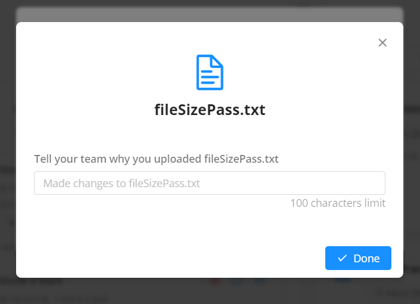

# Tests

## Test environment

Desktop: Chrome 67.0 / Windows 10 / Dell Latitude 3379

Mobile: Mobile Safari / iOS 9.3.2 / iPhone 5S

All tests are verified in both environments

## Important Notes

Variables and data structures used below are for demonstrative purposes only, and does not exactly match the source code - sometimes data irrelevant to a specific test in objects are omitted - to ensure clarity and understandability - but represents the original code to the greatest extent.

e.g. `btnState=loading` may actually be a button that is controlled by a property `state = { status: "loading" }` and have the code / behaviour `<Button loading={this.state.status==="loading" ? true : false} />`

Sometimes that value that is actually used in a test may be too absurd in some way to be written literally in the tables. Paraphrased values will be inclosed in the hash character. e.g. `# A string of 100 characters #`.

If data existed in an object but is not relevant to a test, they may be ommitted of represented by ellipsis. e.g. `user = { ... id:# Kevin Zheng's id #}`

Some syntax that will ensure the following tests are clear to read:

| Notation          | Description                                                                            |
| ----------------- | -------------------------------------------------------------------------------------- |
| `{}`              | Empty object                                                                           |
| `[]`              | Empty array                                                                            |
| `""`              | Empty string                                                                           |
| `null`            | Any value that equals null, including `null`, empty string, or `undefined`             |
| `{x:y}`           | An object with a property named x with the value y                                     |
| `x=y`             | A variable named x with the value y, or the value y was assigned to a variable named x |
| `(x,y)=>x+y`      | A function that takes in x and y as arguments and returns the sum of x and y           |
| description: `{}` | A description of what the data is, and the value is                                    |

UI Elements have built-in input validation or intrinsic restrictions that prevent invalid data from being entered. The following will not be tested individually as it has been verified that it is impossible to enter invalid data of this kind:

| Type                 | Native Input Restrictions                                                                                                                                        |
| -------------------- | ---------------------------------------------------------------------------------------------------------------------------------------------------------------- |
| Text field           | Allow any UTF-8 Character, except characters that require a new line (line break, carriage return etc.). new line characters will be converted to a space (" "). |
| Multiline text field | Allow any UTF-8 Character.                                                                                                                                       |
| Date picker          | Follows the same restrictions as text field. Disallows any input that does not match the format yyyy-mm-dd.                                                      |
| File Open dialog     | Allow any file. Selection of folders or multiple files is disallowed.                                                                                            |

## 0 General

> The Sign In functionality is provided by the Google OAuth API. When a user is signed in, data set in the browser's cookies and local storage, which can be used by this app to authenticate and identify a user.

> Note: In the latest version, the sign in mechanic changed, and no longer determines the sign in state using cookies and webstorage. Instead, the app watches the Firebase UI on animation frames. to make decisions on what to display.

| ID  | Element | Data                                                                           | Expected                                                           | Actual                                         | Fix |
| --- | ------- | ------------------------------------------------------------------------------ | ------------------------------------------------------------------ | ---------------------------------------------- | --- |
| 0.1 | Sign In | App loaded, no Google authentication data in cookies & web storage             | Do nothing                                                         | As expected                                    | -   |
| 0.2 | Sign In | Sign In button pressed, no Google authentication data in cookies & web storage | signIn.buttonState=loading, redirect to Google sign in             | As expected                                    | -   |
| 0.3 | Sign In | App loaded, Google authentication data in cookies & web storage                | signIn.buttonState=loading, Sign in visible=false, user page shown | As expected                                    | -   |
| 0.4 | Sign In | Firebase UI is loading.                                                        | `signInBtnState = loading`                                         | As expected                                    | -   |
| 0.5 | Sign In | Firebase UI is ready.                                                          | `signInBtnState = ready`                                           | As expected  | -   |
| 0.6 | Sign In | Firebase UI is ready. Sign in button pressed.                                  | Start sign in, `signInBtnState = loading`                          | As expected   | -   |
| 0.6 | Sign In | Firebase UI is loading. Sign in button pressed.                                | Do nothing                                                         | As expected                                    | -   |

## 1 Layout

| ID  | Element | Data                | Expected                                             | Actual                                               | Fix |
| --- | ------- | ------------------- | ---------------------------------------------------- | ---------------------------------------------------- | --- |
| 1.1 | Main    | `Window width=1599` | Sidebars collapsed, expand navigation button visible | As expected  | -   |
| 1.2 | Main    | `Window width=1600` | Sidebars expanded, expand navigation button hidden   | As expected       | -   |

## 2 Navigation

| ID  | Element                              | Data                                           | Expected                                                       | Actual                                      | Fix |
| --- | ------------------------------------ | ---------------------------------------------- | -------------------------------------------------------------- | ------------------------------------------- | --- |
| 2.1 | Project sidebar & In-project sidebar | Expand navigation selected, sidebars collapsed | Sidebars expanded                                              | As expected  | -   |
| 2.2 | Project sidebar & In-project sidebar | Expand navigation selected, Sidebars expanded  | Sidebars collapsed                                             | As expected                                 | -   |
| 2.3 | Project sidebar                      | User icon selected                             | User icon highlighted, content switches to user page           | As expected                                 | -   |
| 2.4 | Project sidebar                      | Project icon selected                          | Project icon highlighted, content switches to selected project | As expected                                 | -   |
| 2.5 | In-project sidebar                   | Page item selected                             | Page item highlighted, content switches to selected page       | As expected                                 | -   |

## 3 High-level components

| ID   | Element                   | Data                                                                 | Expected                                                   | Actual                                                | Fix                                                                                                        |
| ---- | ------------------------- | -------------------------------------------------------------------- | ---------------------------------------------------------- | ----------------------------------------------------- | ---------------------------------------------------------------------------------------------------------- |
| 3.1  | Project name label        | `project=null`                                                       | show loading icon                                          | As expected                                           | -                                                                                                          |
| 3.2  | Project name label        | `project.name=null`                                                  | show loading icon                                          | As expected  | -                                                                                                          |
| 3.3  | Project name label        | `project.name=""`                                                    | show "Untitled Project"                                    | loading icon shown                                    | Prevent project name from becoming an empty string by reverting to "Untitled Project" when a change occurs |
| 3.4  | Project name label        | `project.name="Example Title"`                                       | show "Example Title"                                       | As expected                                           | -                                                                                                          |
| 3.5  | Project name label        | `project.name="Really really long title that goes on forever"`       | show truncated title e.g. "A really long name th..."       | As expected          | -                                                                                                          |
| 3.6  | Project description label | `project=null`                                                       | show nothing                                               | As expected                                           | -                                                                                                          |
| 3.7  | Project description label | `project.description=null`                                           | show nothing                                               | As expected                                           | -                                                                                                          |
| 3.8  | Project description label | `project.description=""`                                             | show nothing                                               | As expected                                           | -                                                                                                          |
| 3.9  | Project description label | `project.description="Example Description"`                          | show "Example Description"                                 | As expected                                           | -                                                                                                          |
| 3.10 | Project description label | `project.name="Really really long description that goes on forever"` | show truncated description e.g. "A really long descrip..." | As expected    | -                                                                                                          |
| 3.11 | Project description label | `project.description!=null`, mouse hover                             | show tooltip of project.description                        | As expected (See above for screenshot)                | -                                                                                                          |
| 3.12 | Project description label | `project.description=null`, mouse hover                              | do nothing                                                 | As expected                                           | -                                                                                                          |
| 3.13 | Invite users button       | button pressed                                                       | display invite users modal                                 | As expected                                           | -                                                                                                          |

## 4 Pages

> Pages are displayed by the PageView component, which supplies each page with Project and User information, along with other functionalities. The user page is an exception and does not expect Project information to be supplied to it.

### 4.1 User Page

| ID    | Element                 | Data                                                              | Expected                                               | Actual                                        | Fix |
| ----- | ----------------------- | ----------------------------------------------------------------- | ------------------------------------------------------ | --------------------------------------------- | --- |
| 4.1.1 | Page                    | user = `null`                                                     | Display loading icon and text                          | As expected        | -   |
| 4.1.2 | User Statistics         | user: `{... projects: null, joinedProjects: null, invites: null}` | Display `"Projects: 0, Joined Projects: 0 Invites: 0"` | As expected  | -   |
| 4.1.3 | Projects Gallery        | user: `{... projects: null}`                                      | Display no projects message                            | As expected                                   | -   |
| 4.1.4 | Projects Gallery        | user: `{... projects: [{...}, {...}]}`                            | Display two projects                                   | As expected                                   | -   |
| 4.1.5 | Joined Projects Gallery | user: `{... joinedProjects: null}`                                | Display no joined projects message                     | As expected                                   | -   |
| 4.1.6 | Joined Projects Gallery | user: `{... joinedProjects: [{...},{...}]}`                       | Display two joined projects                            | As expected                                   | -   |
| 4.1.7 | Invites Gallery         | user: `{... pendingInvites: null}`                                | Display no pending invites message                     | As expected                                   | -   |
| 4.1.8 | Invites Gallery         | user: `{... pendingInvites: [{...}, {...}]}`                      | Display two invitations                                | As expected                                   | -   |

### 4.2 Feed Page

| ID     | Element                                                          | Data                                                                                                                                          | Expected                                                                    | Actual      | Fix |
| ------ | ---------------------------------------------------------------- | --------------------------------------------------------------------------------------------------------------------------------------------- | --------------------------------------------------------------------------- | ----------- | --- |
| 4.2.1  | Page                                                             | project = `null`                                                                                                                              | Display loading icon and text                                               | As expected | -   |
| 4.2.2  | Unread Messages Gallery                                          | project: `{... messengerID: "x"}`, messengers: `{...x: {messages: null}}`, user: `{uid: "y"}`                                                 | Display nothing                                                             | As expected | -   |
| 4.2.3  | Unread Messages Gallery                                          | project: `{... messengerID: "x"}`, messengers: `{...x: {messages: {...readBy: {y: true}}}}`, user: `{uid: "y"}`                               | Display nothing                                                             | As expected | -   |
| 4.2.4  | Unread Messages Gallery                                          | project: `{... messengerID: "x"}`, messengers: `{...x: {messages: {...content: {bodyText: "Test"}, readBy: null}}}`, user: `{uid: "y"}`       | Display one message "Test"                                                  | As expected | -   |
| 4.2.5  | Unread Messages Gallery                                          | project: `{... messengerID: "x"}`, messengers: `{...x: {messages: {...content: {bodyText: "Test"}, readBy: {y: false}}}}`, user: `{uid: "y"}` | Display one message "Test"                                                  | As expected | -   |
| 4.2.6  | Upcoming Events Gallery                                          | project: `{... events: null}`                                                                                                                 | Display nothing                                                             | As expected | -   |
| 4.2.7  | Upcoming Events Gallery                                          | project: `{... events: [{date: # Time before current time #}]}`                                                                               | Display nothing                                                             | As expected | -   |
| 4.2.8  | Upcoming Events Gallery                                          | project: `{... events: [{date: # Time exactly equal to current time #}]}`                                                                     | Event displayed                                                             | As expected | -   |
| 4.2.9  | Upcoming Events Gallery                                          | project: `{... events: [{date: # Time equal to exactly 5 days after current time #}]}`                                                        | Event displayed                                                             | As expected | -   |
| 4.2.10 | Upcoming Events Gallery                                          | project: `{... events: [{date: # Time equal to more than 5 days after current time #}]}`                                                      | Display nothing                                                             | As expected | -   |
| 4.2.11 | Upcoming Events Gallery                                          | project: `{... events: [{markedAsCompleted: true}]}`                                                                                          | Display nothing                                                             | As expected | -   |
| 4.2.12 | Changes Gallery                                                  | project: `{... history: null}`                                                                                                                | Display nothing                                                             | As expected | -   |
| 4.2.13 | Changes Gallery                                                  | project: `{... history: [{ ...}, {...}]}`                                                                                                     | Display 2 events                                                            | As expected | -   |
| 4.2.14 | History Event Item                                               | change: `{}`                                                                                                                                  | Display nothing                                                             | As expected | -   |
| 4.2.15 | History Event Description Generation, indefinite article grammar | change: `{action: "added", type: "event", doneBy:"x", doneAt: # 12 minutes ago # }` users `{uid: x, name: "Name"}`                            | "Name added an event 12 minutes ago"                                        | As expected | -   |
| 4.2.16 | History Event Description Generation, indefinite article grammer | change: `{action: "added", type: "file", doneBy:"x", doneAt: # 12 minutes ago # }` users `{uid: x, name: "Name"}`                             | "Name added a file 12 minutes ago"                                          | As expected | -   |
| 4.2.17 | History Event Description Generation, relative time              | change: `{action: "added", type: "file", doneBy:"x", doneAt: # now # }` users `{uid: x, name: "Name"}`                                        | "Name added a file a few seconds ago"            | As expected | -   |
| 4.2.18 | History Event Description Generation, relative time              | change: `{action: "added", type: "file", doneBy:"x", doneAt: # 7 days before (Wednesday 5:02pm) # }` users `{uid: x, name: "Name"}`           | "Name added a file a last Wednesday at 4:02 pm"                             | As expected | -   |
| 4.2.19 | History Event Description Generation, absolute time              | change: `{action: "added", type: "file", doneBy:"x", doneAt: # 8 days before (Tuesday, 14th of August) # }` users `{uid: x, name: "Name"}`    | "Name added a file 13/08/18"                                                | As expected | -   |
| 4.2.20 | History Event Item, Mention Button                               | change: `{...}`, Mention Button Pressed                                                                                                       | Switch to timeline page, mentioned item sent                                | As expected | -   |
| 4.2.21 | History Event Item, Switch Button                                | change: `{... type: "event"}`, Switch Button Pressed                                                                                          | Switch to timeline page                                                     | As expected | -   |
| 4.2.22 | History Event Item, Switch Button                                | change: `{... type: "file"}`, Switch Button Pressed                                                                                           | Switch to file page                                                         | As expected | -   |
| 4.2.23 | History Event Item, Switch Button                                | change: `{... type: "description"}`                                                                                                           | Switch Button hidden                                                        | As expected | -   |
| 4.2.24 | History Event Item, Switch Button                                | change: `{... type: "project"}`                                                                                                               | Switch Button hidden                                                        | As expected | -   |
| 4.2.25 | History Event Item, Switch Button                                | change: `{... type: "name"}`                                                                                                                  | Switch Button hidden                                                        | As expected | -   |
| 4.2.26 | History Event Item, Switch Button                                | change: `{... type: "roles"}`                                                                                                                 | Switch Button hidden                                                        | As expected | -   |
| 4.2.27 | Load More Button                                                 | history: `{[# array of 20 changes #]}`, loaded 8, button pressed                                                                              | Show 16 changes                                                             | As expected | -   |
| 4.2.28 | Load More Button                                                 | history: `{[# array of 20 changes #]}`, loaded 16, button pressed                                                                             | Show 20 changes, `button.visible = false`, display `"Nothing else to show"` | As expected | -   |

### 4.3 Members Page

| ID    | Element                     | Data                                                                                                                  | Expected                                           | Actual                                | Fix |
| ----- | --------------------------- | --------------------------------------------------------------------------------------------------------------------- | -------------------------------------------------- | ------------------------------------- | --- |
| 4.3.1 | Members Gallery             | project: `{... members: # Array of 3 members #}`                                                                      | Display 3 members                                  | As expected                           | -   |
| 4.3.2 | Members Gallery             | project: `{... members: null}`                                                                                        | Display nothing                                    | As expected                           | -   |
| 4.3.3 | Invite Users Button         | Button pressed                                                                                                        | Open Invite Users form                             | As expected                           | -   |
| 4.3.4 | Member Display, role picker | member: `{... roles: [{... name: "x"}]}`, project: `{... roles: [{... name: "x"}, {... name: "y"}]}`                  | Show role `"x"`, available roles: `{...name: "y"}` | As expected  | -   |
| 4.3.5 | Member Display, role picker | member: `{... roles: [{... name: "x"}, {... name: "y"}]}`, project: `{... roles: [{... name: "x"}, {... name: "y"}]}` | Display `"Configure roles in project settings"`    | As expected                           | -   |

### 4.4 Timeline Page

| ID     | Element                                         | Data                                                                                                                     | Expected                                                                                                | Actual                                      | Fix |
| ------ | ----------------------------------------------- | ------------------------------------------------------------------------------------------------------------------------ | ------------------------------------------------------------------------------------------------------- | ------------------------------------------- | --- |
| 4.4.1  | Timeline Gallery, date order                    | events: `[{... date: # 3/8/18 #},{... date: # 1/8/18 #},{... date: # 2/8/18 #},{... date: # 3/8/18 #}]`                  | display `[{... date: # 1/8/18 #},{... date: # 2/8/18 #},{... date: # 3/8/18 #},{... date: # 3/8/18 #}]` | As expected  | -   |
| 4.4.2  | Timeline Gallery Item                           | event: `{... creator: "x"}`, user: `{... uid: "x", name: "Name"}`                                                        | Display Creator `"Name"`                                                                                | As expected                                 | -   |
| 4.4.3  | Timeline Gallery Item, relative date            | event: `{... date: # 6/09/18 #}`, current date: 1/09/18                                                                  | Display `"Next Thursday"`                                                                               | As expected                                 | -   |
| 4.4.4  | Timeline Gallery Item, relative date            | event: `{... date: # 7/09/18 #}`, current date: 1/09/18                                                                  | Display Nothing                                                                                         | As expected                                 | -   |
| 4.4.5  | Timeline Gallery Item, relative date            | event: `{... date: # 1/09/18 #}`, current date: 1/09/18                                                                  | Display `"Today"`                                                                                       | As expected                                 | -   |
| 4.4.6  | Timeline Gallery Item, relative date            | event: `{... date: # 30/08/18 #}`, current date: 1/09/18                                                                 | Display Nothing                                                                                         | As expected                                 | -   |
| 4.4.7  | Timeline Gallery Item, current user involvement | event: `{... involvedPeople:null}`                                                                                       | Display nothing                                                                                         | As expected                                 | -   |
| 4.4.8  | Timeline Gallery Item, current user involvement | event: `{... involvedPeople:{members:["x"]}}` user: `{... uid: "x", name: "Name"}`                                       | Display `"You're involved"`                                                                             | As expected                                 | -   |
| 4.4.9  | Timeline Gallery Item, current user involvement | event: `{... involvedPeople:{roles:["a"]}}` user: `{... uid: "x", name: "Name"}`, member: `{... uid: "x", roles: null}`  | Display nothing                                                                                         | As expected                                 | -   |
| 4.4.10 | Timeline Gallery Item, current user involvement | event: `{... involvedPeople:{roles:["a"]}}` user: `{... uid: "x", name: "Name"}`, member: `{... uid: "x", roles: ["a"]}` | Display `"You're involved"`                                                                             | As expected                                 | -   |
| 4.4.11 | Timeline Gallery Item, edit button              | button pressed                                                                                                           | Open edit event window                                                                                  | As expected                                 | -   |
| 4.4.12 | Timeline Gallery Item, mention button           | button pressed                                                                                                           | Switch to timeline page, mentioned event sent                                                           | As expected                                 | -   |
| 4.4.13 | Timeline Gallery Item, complete button          | button pressed                                                                                                           | event: `{... markedAsCompleted: true}`                                                                  | As expected                                 | -   |
| 4.4.14 | Timeline Gallery Item, complete button          | event: `{... markedAsCompleted: true}`                                                                                   | complete button visible = false                                                                         | As expected                                 | -   |

### 4.5 Files Page

| ID     | Element                            | Data                                                                                                                                                                                                                                                                          | Expected                                     | Actual      | Fix |
| ------ | ---------------------------------- | ----------------------------------------------------------------------------------------------------------------------------------------------------------------------------------------------------------------------------------------------------------------------------- | -------------------------------------------- | ----------- | --- |
| 4.5.1  | File Gallery Item                  | file: `{... uploadType: "local", name: Test.txt, files: [{description: "Description", name: "Text.txt", size: 3 bytes, uploadTime: # 27/8/18 4:05 pm # }]}`                                                                                                                   | Display one file, "Text.txt'                 | As expected | -   |
| 4.5.2  | File Gallery Item                  | file: `{... uploadType: "local", name: Test.txt, files: [{description: "Description", name: "Text.txt", size: 3 bytes, uploadTime: # 27/8/18 4:05 pm # }, {description: "Description2", name: "Text.txt", size: 3 bytes, uploadTime: # 27/8/18 4:15 pm # }]}`                 | Display one file with two versions           | As expected | -   |
| 4.5.3  | File Gallery Item, download button | button pressed, file: `{... uploadType: "local", name: Test.txt, files: [{description: "Description", name: "Text.txt", size: 3 bytes, uploadTime: # 27/8/18 4:05 pm # }, {description: "Description2", name: "Text.txt", size: 3 bytes, uploadTime: # 27/8/18 4:15 pm # }]}` | Description2 opened in new window            | As expected | -   |
| 4.5.4  | File Gallery Item, mention button  | button pressed                                                                                                                                                                                                                                                                | Switch to timeline page, mentioned file sent | As expected | -   |
| 4.5.5  | File Gallery Item, mention button  | file: `{... uploadType: "local"}`                                                                                                                                                                                                                                             | Open add file window                         | As expected | -   |
| 4.5.6  | File Gallery Item, delete button   | file: `{... uploadType: "local", uid: "x"}`, files: `[{... uid: "x"}, {... uid: "y"}]` button pressed, confirm pressed                                                                                                                                                        | files: `[{... uid: "y"}]`                    | As expected | -   |
| 4.5.7  | File Version, delete button        | button pressed, version: `{versionId: "vx"}` file: `{files: [{versionId:"vx"}, {versionId: "vy"}]}`                                                                                                                                                                           | file: `{files: [{versionId: "vy"}]}`         | As expected | -   |
| 4.5.8  | File Version, mention button       | button pressed                                                                                                                                                                                                                                                                | Switch to timeline page, mentioned file sent | -           |
| 4.5.9  | File Search                        | files: `[{... name: "File.txt"}]`, query: `"File"`                                                                                                                                                                                                                            | searchResults: `[{... name: "File.txt"}]`    | As expected |
| 4.5.10 | File Search                        | files: `[{... name: "File.txt"}]`, query: `"txt"`                                                                                                                                                                                                                             | searchResults: `[{... name: "File.txt"}]`    | As expected |
| 4.5.11 | File Search                        | files: `[{... name: "File.txt"}]`, query: `"f"`                                                                                                                                                                                                                               | searchResults: `[{... name: "File.txt"}]`    | As expected |
| 4.5.12 | File Search                        | files: `[{... name: "File.txt"}]`, query: `""`                                                                                                                                                                                                                                | searchResults: `[]`, display all files       | As expected |
| 4.5.13 | File Search                        | files: `[{... name: "File.txt"}]`, query: `"File2"`                                                                                                                                                                                                                           | searchResults: `[]`, not found message       | As expected |

### 4.6 Discuss Page

| ID     | Element                     | Data                                                                                                                                                                | Expected                                                                                                                             | Actual      | Fix |
| ------ | --------------------------- | ------------------------------------------------------------------------------------------------------------------------------------------------------------------- | ------------------------------------------------------------------------------------------------------------------------------------ | ----------- | --- |
| 4.6.1  | Input                       | `input.value = ""`                                                                                                                                                  | send.disabled = true                                                                                                                 | As expected | -   |
| 4.6.2  | Input                       | `input.value = " "`                                                                                                                                                 | send.disabled = true                                                                                                                 | As expected | -   |
| 4.6.3  | Input                       | `input.value = " x "`                                                                                                                                               | send.disabled = false                                                                                                                | As expected | -   |
| 4.6.4  | Messages                    | messages: `null`                                                                                                                                                    | Display no messages message                                                                                                          | As expected | -   |
| 4.6.5  | Send Message                | `input.value = # String of 2000 characters #`                                                                                                                       | messageContent:`{bodyText: # String of 2000 characters #}`, `input.value = ""`                                                       | As expected | -   |
| 4.6.6  | Send Message                | `input.value = # String of 2001 characters #`                                                                                                                       | messageContent:`{bodyText: # String of 2000 characters #}`, trimmed, `input.value = ""`                                              | As expected | -   |
| 4.6.7  | Message Edit                | message: `{... sender: "y"}` `user: {uid:"x"}`                                                                                                                      | edit.disabled = true                                                                                                                 | As expected | -   |
| 4.6.8  | Message Edit                | message: `{... sender: "y"}` `user: {uid:"y"}`                                                                                                                      | edit.disabled = false                                                                                                                | As expected | -   |
| 4.6.9  | Message Edit                | message: `{... sender: "y", bodyContent: {bodyText:"Message"}}` `user: {... uid:"y"}`, button pressed                                                               | `input.value = "Message"`, `console.status = "editing"`                                                                              | As expected | -   |
| 4.6.10 | Message Edit, submit        | message: `{... sender: "y", bodyContent: {bodyText:"Message"}}` `user: {... uid:"y"}`, `input.value = "Message Edited"`, `console.status = "editing"`, send pressed | `input.value = ""`, `console.status = "ready"`, message: `{... sender: "y", bodyContent: {bodyText:"Message Edited"}, edited: true}` | As expected | -   |
| 4.6.11 | Message Edit, cancel        | message: `{... sender: "y", bodyContent: {bodyText:"Message"}}` `user: {... uid:"y"}`, `input.value = "Message Edited"`, `console.status = "editing"`, send pressed | `input.value = ""`, `console.status = "ready"`, message: `{... sender: "y", bodyContent: {bodyText:"Message"}, edited: true}`        | As expected | -   |
| 4.6.12 | Message Delete              | message: `{... uid: "x"}`, messages: `[{... uid: "x"}, {... uid: "y"}]` button pressed, confirm pressed                                                             | messages: `[{... uid: "y"}]`                                                                                                         | As expected | -   |
| 4.6.13 | Message Quote               | message: `{... sender: "y", bodyContent: {bodyText:"Message"}, timeSent: # 4:45 PM 27/8/18 #}` `user: {... uid:"y", name: "Name"}`, button pressed                  | `input.value = "Name on 4:45 PM 27/8/18 said: Message"`                                                                              | As expected | -   |
| 4.6.14 | Mentioned User Suggestions  | `input.value = "@"`, members: `[{... name: "Kevin Zheng"}]`, roles: `[{... name: "x"},{... name: "y"}]`                                                             | Suggestions visible, `["Kevin Zheng", "x", "y"]`                                                                                     | As expected | -   |
| 4.6.15 | Mentioned User Suggestions  | `input.value = "@x"`, members: `[{... name: "Kevin Zheng"}]`, roles: `[{... name: "x"},{... name: "y"}]`                                                            | Suggestions visible, `["x"]`                                                                                                         | As expected | -   |
| 4.6.16 | Mentioned User Suggestions  | `input.value = "@xx"`, members: `[{... name: "Kevin Zheng"}]`, roles: `[{... name: "x"},{... name: "y"}]`                                                           | Suggestions visible, no matches message displayed                                                                                    | As expected | -   |
| 4.6.17 | Mentioned User Selection    | selected suggestion: `[{... name: "Kevin Zheng", instanceID: "1147"}]`, `input.value = "@"`                                                                         | Suggestions hidden, `input.value = @Kevin Zheng#1147`                                                                                | As expected | -   |
| 4.6.18 | Mentioned User Highlighting | message: `{bodyContent: {bodyText: "@Kevin Zheng#1147"}}` user: `{... instanceID: "1147", name: "Kevin Zheng"}`                                                     | Message Highlighted, Kevin Zheng displayed as tag                                                                                    | As expected | -   |
| 4.6.19 | Mentioned User Highlighting | message: `{bodyContent: {bodyText: "@x#1439"}}` member: `{... roles: ["x"], instanceID: "1147", name: "Kevin Zheng"}` project roles: `[{...name: "x"}]`             | Message Highlighted, role displayed as tag                                                                                           | As expected | -   |

### 5.1 Invite Users Panel

> The User Picker is a component that directly searches and returns registered users from the database based on their email using a search string. The component restricts user input to be plain text with no line breaks.

| ID    | Element             | Data                                                                                                   | Expected                                                              | Actual                                                      | Fix |
| ----- | ------------------- | ------------------------------------------------------------------------------------------------------ | --------------------------------------------------------------------- | ----------------------------------------------------------- | --- |
| 5.1.1 | User picker         | `input=""`                                                                                             | do nothing                                                            | As expected                                                 | -   |
| 5.1.2 | User picker         | `input="x"`, `database.users=["x@e.com","y@e.com"]`                                                    | suggest "x@e.com"                                                     | As expected                                                 | -   |
| 5.1.3 | User picker         | `input="x"`, `database.users=["x1@e.com","x2@e.com","y@e.com"]`                                        | suggest `["x1@e.com","x2@e.com"]`                                     | As expected                  | -   |
| 5.1.4 | User picker         | `input="x"` , `database.users=["x1@e.com","2x@e.com","y@x.com"]`                                       | suggest `"x1@e.com"`                                                  | As expected                                                 | -   |
| 5.1.5 | User picker         | `suggestedUsers=["x1@e.com"]`, pressed `"x1@e.com"`, `selectedUsers=[]`                                | `selectedUsers=["x1@e.com"]`                                          | As expected                                                 | -   |
| 5.1.6 | User picker         | `suggestedUsers=["x1@e.com","2x@e.com","y@x.com"]`, pressed `"x1@e.com"`, `selectedUsers=["2x@e.com"]` | `selectedUsers=["2x@e.com", "x1@e.com"]`                              | As expected                                                 | -   |
| 5.1.7 | Invite Users Button | `selectedUsers=[]`                                                                                     | disable button                                                        | As expected  | -   |
| 5.1.8 | Invite Users Button | `selectedUsers=["x@e.com"]`                                                                            | enable button                                                         | As expected   | -   |
| 5.1.9 | Invite Users Button | `selectedUsers=["x@e.com","2x@e.com","y@x.com"]`                                                       | request add users for `["x@e.com","2x@e.com","y@x.com"]`, close panel | As expected                                                 | -   |

### 5.2 Add/Edit Event

> For tests on limiting the length of the name and description fields, see 5.3.3, 5.3.4, 5.3.5, 5.3.6, 5.3.7, 5.3.8 as the same code is used.

| ID    | Element                   | Data                                                                                                                                                                    | Expected                                                                                                                                                          | Actual                                      | Fix |
| ----- | ------------------------- | ----------------------------------------------------------------------------------------------------------------------------------------------------------------------- | ----------------------------------------------------------------------------------------------------------------------------------------------------------------- | ------------------------------------------- | --- |
| 5.2.1 | Add event                 | input data: `{name:"a", description:"b", "date":1533866631775 ,notify:1,autoComplete:false, involvedPeople: null}`, environment: `user.uid = # Kevin Zheng's user id #` | Event created with data `{... name:"a", description:"b",date:1533866631775,notify:1,autoComplete:false, creator: # Kevin Zheng's user id #}`                      | As expected                                 | -   |
| 5.2.2 | Add event                 | input data: `{}`, environment: `user.uid = # Kevin Zheng's user id #`                                                                                                   | Event created with data `{... name:"Untitled Event", description:null, creator: "Kevin Zheng's user id", date:# current date #, notify: -1, autoComplete: false}` | As expected  | -   |
| 5.2.3 | Edit Event, delete button | events: `[{uid: "x"}, {uid: "y"}]`, event: `{... uid: "x"}`, Button pressed, confirm selected                                                                           | events: `[{uid: "y"}]`                                                                                                                                            |
| 5.2.4 | Autocomplete              | event: `{... uid: "x", date: # 1 day before today #, autoComplete: true}`                                                                                               | event: `{...markedAsCompleted: true}`                                                                                                                             |
| 5.2.5 | Autocomplete              | event: `{... uid: "x", date: # today #, autoComplete: true}`                                                                                                            | event: `{...markedAsCompleted: true}`                                                                                                                             |
| 5.2.6 | Autocomplete              | event: `{... uid: "x", date: # 1 day after today #, autoComplete: true}`                                                                                                | event: `{...markedAsCompleted: false}`                                                                                                                            |

### 5.3 Add Project

| ID    | Element     | Data                                                                                                       | Expected                                                                                                                  | Actual                                                      | Fix |
| ----- | ----------- | ---------------------------------------------------------------------------------------------------------- | ------------------------------------------------------------------------------------------------------------------------- | ----------------------------------------------------------- | --- |
| 5.3.1 | New Project | input data: `{name:null, description: null, invitePeople: null}`                                           | project created with `{name: "Untitled Project": description: null}`                                                      | As expected                                                 | -   |
| 5.3.2 | New Project | input data: `{name: "Project", description: "Project Description", invitePeople: null}`                    | project created with `{name: "Project", description: "Project Description"}`                                              | As expected                                                 | -   |
| 5.3.3 | New Project | input data: `{name: # String of 100 characters #, description: "Project Description", invitePeople: null}` | project created with `{name: # String of 100 characters #, description: "Project Description"}`                           | As expected                                                 | -   |
| 5.3.4 | New Project | input data: `{name: # String of 101 characters #, description: "Project Description", invitePeople: null}` | project created with `{name: # String of 100 characters #, description: "Project Description"}`, final character trimmed. | As expected         | -   |
| 5.3.5 | New Project | input data: `{name: " X ", description: "Project Description", invitePeople: null}`                        | project created with `{name: "X", description: "Project Description"}`                                                    | As expected                                                 | -   |
| 5.3.6 | New Project | input data: `{name: "Project Name", description: " X ", invitePeople: null}`                               | project created with `{name: "Project Name", description: " X "}` (Not trimmed. )                                         | As expected                                                 | -   |
| 5.3.7 | New Project | input data: `{name: "Project Name", description: # String of 2000 characters #, invitePeople: null}`       | project created with `{name: "Project Name", description: # String of 2000 characters #}`                                 | As expected                                                 | -   |
| 5.3.8 | New Project | input data: `{name: "Project Name", description: # String of 2001 characters #, invitePeople: null}`       | project created with `{name: "Project Name", description: # String of 2000 characters #}`, final character trimmed.       | As expected  | -   |

### 5.4 Add File

> Test files created with `fsutil file createnew <filename> <filesize>` For comment file length tests, see 5.3.3, 5.3.4, 5.3.5

| ID    | Element        | Data                                       | Expected                                        | Actual                                                                        | Fix                                                                                                       |
| ----- | -------------- | ------------------------------------------ | ----------------------------------------------- | ----------------------------------------------------------------------------- | --------------------------------------------------------------------------------------------------------- |
| 5.4.1 | Add File Panel | file: `{... size=52,428,800}`              | File allowed, show window to enter description  | As expected   | -                                                                                                         |
| 5.4.2 | Add File Panel | file: `{... size=52,428,801}`              | File denied, show error                         | As expected                                 | -                                                                                                         |
| 5.4.3 | Add File Panel | file: `{... size=0}`                       | File allowed, show window to enter description  | As expected                                                                   | -                                                                                                         |
| 5.4.4 | Drag & Drop    | file: Empty folder                         | Folder denied                                   | Folder starts uploading, displays error.                                      | Add a check for when a folder is dropped into the upload zone. See below.  |
| 5.4.5 | Drag & Drop    | files: `[{...}, {...}]`                    | First file accepted                             | As expected.                                                                  | -                                                                                                         |
| 5.4.6 | File Comment   | `comment=""`, file: `{... name: test.txt}` | `file.description = "Made Changes to test.txt"` | As expected                                                                   | -                                                                                                         |

```javascript
// Test if the file size is a multiple of 4096, since all folders have this property.
if (file.size % 4096 === 0) {
  let reader = new FileReader();
  // If the file has such a size, read the file to check if its a folder. This may take time, which is why the file size check is performed first.
  reader.onload = () => {
    // Otherwise, select the file, and go to the next step.
    this.setState({
      selectedFile: file,
      modalVisible: true,
      loading: false
    });
  };
  reader.onerror = () => {
    message.error("Unfortunately, we currently don't support uploading folders.");
  };
  reader.readAsText(file);
  return;
}
```

### 5.5 Settings

| ID    | Element          | Data                                                                    | Expected                                                                  | Actual      | Fix |
| ----- | ---------------- | ----------------------------------------------------------------------- | ------------------------------------------------------------------------- | ----------- | --- |
| 5.5.1 | Settings on save | selected roles:`[{ name: "New Role" }]`, project roles: `[]`            | project roles: `[{ name: "New Role" }]`, changed recorded as history item | As expected | -   |
| 5.5.1 | Settings on save | roles:`[{ name: "New Role" }]`, project roles: `[{ name: "New Role" }]` | project roles: `[{ name: "New Role" }]`                                   | As expected | -   |

#### 5.5.1 General Settings

> For tests relating to project name, refer to 5.3.3, 5.3.4, 5.3.5 For tests relating to project description, refer to 5.3.6, 5.3.7, 5.3.8

#### 5.5.2 Roles

| ID      | Element            | Data                                                                                                        | Expected                                                                                             | Actual                                   | Fix |
| ------- | ------------------ | ----------------------------------------------------------------------------------------------------------- | ---------------------------------------------------------------------------------------------------- | ---------------------------------------- | --- |
| 5.5.2.1 | Add Role Button    | selected roles: `[]`, button pressed.                                                                       | roles: `[{uid: # Randomly genenrated ID #, name: "New Role", color: # Randomly generated colour #}]` | As expected  | -   |
| 5.5.2.2 | Remove Role Button | selected roles: `[{... name: "New Role"}, {... name: "New Role 2"}]`, Delete button pressed for second role | roles: `[{name: "New Role"}]`                                                                        | As expected                              | -   |
| 5.5.2.3 | Role Text Field    | role data: `{... name: null}`                                                                               | role created with `{... name: "New Role"}`                                                           | As expected                              | -   |
| 5.5.2.4 | Role Text Field    | role data: `{... name: # String of 100 characters #}`                                                       | role created with `{... name: # String of 100 characters #}`                                         | As expected                              | -   |
| 5.5.2.5 | Role Text Field    | role data: `{... name: # String of 101 characters #}`                                                       | role created with `{... name: # String of 100 characters #}`, final character trimmed                | As expected                              | -   |
| 5.5.2.6 | Role Text Field    | role data: `{... name: " New Role "}`                                                                       | role created with `{... name: "New Role"}`                                                           | As expected                              | -   |

#### 5.5.3 Advanced

| ID      | Element               | Data                                                                                        | Expected                                         | Actual      | Fix |
| ------- | --------------------- | ------------------------------------------------------------------------------------------- | ------------------------------------------------ | ----------- | --- |
| 5.5.3.1 | Delete Project Button | project: `{... owner: "x" }`, current user: `{... uid: "x"}`                                | `button.visible=true`                            | As expected | -   |
| 5.5.3.2 | Delete Project Button | project: `{... owner: "x" }`, current user: `{... uid: "y"}`                                | `button.visible=false`                           | As expected | -   |
| 5.5.3.3 | Leave Project Button  | project: `{... owner: "x" }`, current user: `{... uid: "x"}`                                | `button.visible=false`                           | As expected | -   |
| 5.5.3.4 | Leave Project Button  | project: `{... owner: "x" }`, current user: `{... uid: "y"}`                                | `button.visible=true`                            | As expected | -   |
| 5.5.3.5 | Delete Project        | project: `{... owner: "x" }`, current user: `{... uid: "x"}`                                | project: `{deleted: true}`                       | As expected | -   |
| 5.5.3.6 | Delete Project        | project: `{... owner: "x" }`, current user: `{... uid: "y"}`                                | Show "not the owner" message, project unchanged. | As expected | -   |
| 5.5.3.7 | Leave Project Button  | project: `{... owner: "x", members: [... {... uid: "y"}] }`, current user: `{... uid: "y"}` | project: `{... owner: "x", members: [...] }`     | As expected | -   |

## 6 Data & Fetching

> Tests for adding and setting data to users and projects are available in Section 7

| ID  | Element           | Data                                                                                                        | Expected                        | Actual      | Fix |
| --- | ----------------- | ----------------------------------------------------------------------------------------------------------- | ------------------------------- | ----------- | --- |
| 6.1 | User Fetcher      | `userID=null`                                                                                               | return `null`                   | As expected | -   |
| 6.2 | User Fetcher      | `userID="x"`, `database.users=[{... userID: "x"},{... userID:"y"},{... userID:"z"}]`                        | return `{... userID: "x"}`      | As expected | -   |
| 6.3 | User Fetcher      | `userID="x"`, `database.users=[{... userID: "a"},{... userID:"b"},{... userID:"c"}]`                        | As expected                     | -           |
| 6.4 | Project Fetcher   | `projectID=null`                                                                                            | return `null`                   | As expected | -   |
| 6.5 | Project Fetcher   | `projectID="x"`, `database.projects=[{... projectID: "x"},{... projectID:"y"},{... projectID:"z"}]`         | return `{... projectID: "x"}`   | As expected | -   |
| 6.6 | Project Fetcher   | `projectID="x"`, `database.projects=[{... projectID: "a"},{... projectID:"b"},{... projectID:"c"}]`         | return `null`                   | As expected | -   |
| 6.7 | Messenger Fetcher | `messengerID=null`                                                                                          | return `null`                   | As expected | -   |
| 6.8 | Messenger Fetcher | `messengerID="x"`, `database.messages=[{... messengerID: "x"},{... messengerID:"y"},{... messengerID:"z"}]` | return `{... messengerID: "x"}` | As expected | -   |
| 6.9 | Messenger Fetcher | `messengerID="x"`, `database.messages=[{... messengerID: "a"},{... messengerID:"b"},{... messengerID:"c"}]` | return `null`                   | As expected | -   |

## 7 Utilities

### 7.1 Quicksort

| ID    | Element                       | Data                                                          | Expected                    | Actual      | Fix |
| ----- | ----------------------------- | ------------------------------------------------------------- | --------------------------- | ----------- | --- |
| 7.1.1 | Quicksort, order              | source: `[7,3,7,8,9,1,3,9,0]`, comparator: `(a,b)=>a-b`       | `[0,1,3,3,7,7,8,9,9]`       | As expected | -   |
| 7.1.2 | Quicksort, empty              | source: `[]`, comparator: `(a,b)=>a-b`                        | `[]`                        | As expected | -   |
| 7.1.3 | Quicksort, decimals           | source: `[2.2,2.3,2.6,2.1,1.1,9.1]`, comparator: `(a,b)=>a-b` | `[1.1,2.1,2.2,2.3,2.6,9.1]` | As expected | -   |
| 7.1.4 | Quicksort, null               | source: `null`, comparator: `null`                            | Throw error                 | As expected | -   |
| 7.1.5 | Quicksort, non-numeric values | source: `["a","b",2,1]`, comparator: `(a,b)=>a-b`             | `["a","b",1,2]`             | As expected | -   |

### 7.2 Notifier

| ID    | Element                  | Data                                                                                                                               | Expected                                                                         | Actual      | Fix |
| ----- | ------------------------ | ---------------------------------------------------------------------------------------------------------------------------------- | -------------------------------------------------------------------------------- | ----------- | --- |
| 7.2.1 | Message notifications    | Window defocused, new message: `{... sender: "x", bodyText: "y"}`, project.name: `"Project"`                                       | Display notification `{title: "Project - x", body: "y"}`                         | As expected | -   |
| 7.2.2 | Message notifications    | Window focused, new message: `{... sender: "x", bodyText: "y"}`                                                                    | Display nothing                                                                  | As expected | -   |
| 7.2.3 | New change notifications | Window defocused, change: `{action: "added", type: "event", doneBy:"x"}` users `{uid: x, name: "Name"}`, project.name: `"Project"` | Display notification `{title: "Bonfire - Project", body: "Name added an event"}` | As expected | -   |
| 7.2.4 | New change notifications | Window focused, change: `{action: "added", type: "event", doneBy:"x"}` users `{uid: x, name: "Name"}`, project.name: `"Project"`   | Display nothing                                                                  | As expected | -   |
