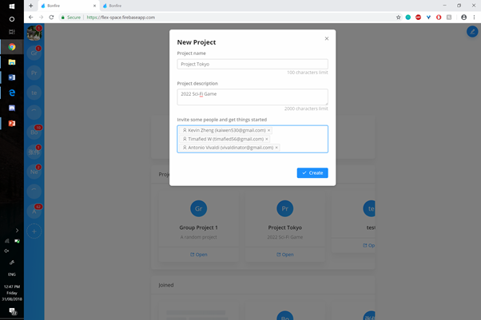

# User Acceptance Testing

## 1 Procedure

The test involves the client, and a few collaborators (4).

The individuals as a group must complete common tasks required in a team project.

The tests will incorporate the following:

- Creating and inviting users to a project.
- The ability to clearly communicate with each member what they are responsible for.
- Assigning people roles and tasks to do.
- Creating clear goals and deadlines.
- Completing a goal.
- Sharing documents through Google Drive.
- Sharing documents through files.
- Updating documents.
- Staying up-to-date with the progress of the project.

Users will then complete a Google Forms survey after the test, to evaluate user experience.

## 2 Results

### 2.1 Test Results

| ID  | Transactions to be tested            | Resources                                                                   | Test Result Code |
| --- | ------------------------------------ | --------------------------------------------------------------------------- | ---------------- |
| 1   | Creating a project                   | Client, Laptop with internet connection, Bonfire                            | `A`              |
| 2   | Inviting users to a project          | Client, Laptop with internet connection, Bonfire                            | `A`
| 2   | Discussion of when goals must be set | Client, collaborators, each with a laptop with internet connection, Bonfire |
| 3   | Assignment of roles and tasks        | Client, collaborators, each with a laptop with internet connection, Bonfire |
| 4   | Creation of goals and deadlines      |
| 5   | Completion of goals                  |
| 6   | Sharing of files                     |
| 7   | Using versioning to manage files     |
| 8   | Sharing Google Drive files           |
| 9   | Noticing changes                     |
| 10  | General user experience              | Google Forms Survey                                                         |                  |

### 2.2 Review of Test Results

### 2.3 Corrective Action

### 2.4 Appendix

Creating a project.