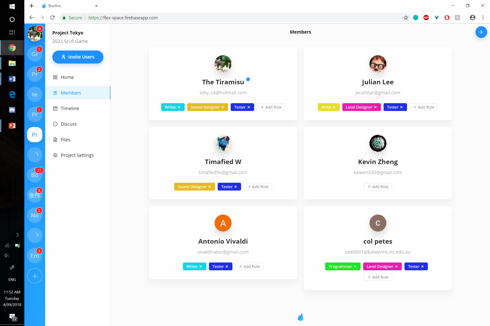
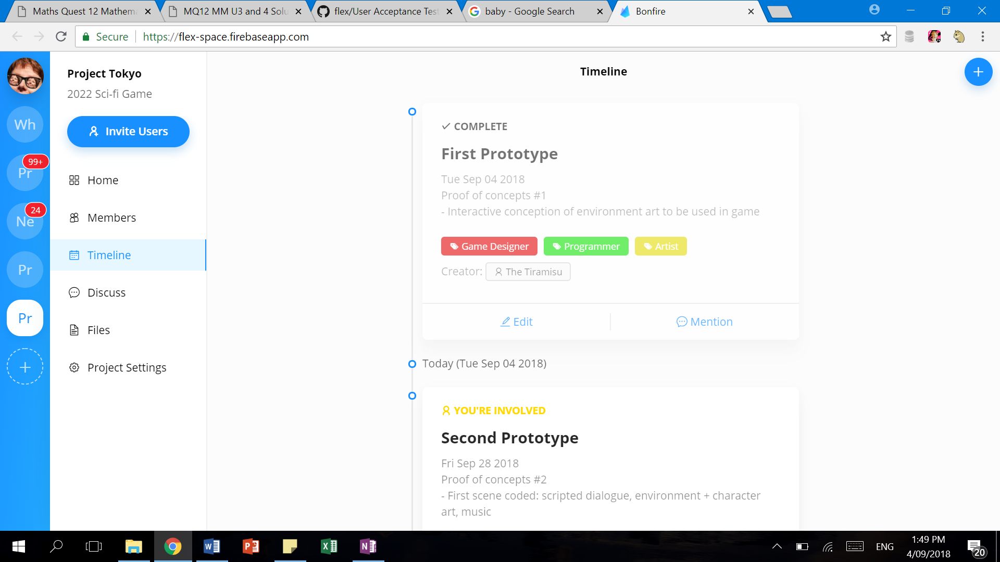

# User Acceptance Testing

## 1 Procedure

The test involves the client, and a few collaborators (4).

The individuals as a group must complete common tasks required in a team project.

The tests will incorporate the following:

- Creating and inviting users to a project.

- The ability to clearly communicate with each member what they are responsible for.

- Assigning people roles and tasks to do.

- Creating clear goals and deadlines.

- Completing a goal.

- Sharing documents through Google Drive.

- Sharing documents through files.

- Updating documents.

- Staying up-to-date with the progress of the project.

Users will then complete a Google Forms survey after the test, to evaluate user experience. An average rating of 4/5 is considered a success.

A mock project will be used, detailed as follows:

### Tokyo

2022 Science Fiction Game

#### Members

**Edward Tang** _Project Owner_
silky_ok@hotmail.com

**Julian Lee**
jxcalistar@gmail.com

**Tim Wang**
timafied56@gmail.com

**Patrick Li**
vivaldinator@gmail.com

**Cole Peeters**
pee0001@balwynhs.vic.edu.au

#### Key dates

##### First Prototype

Description: Proof of concepts #1. Interactive conception of environment art to be used in game

Date: September 04 2018

Involved people: Game designers, programmers, artists.

Notify: A week before

Complete Automatically: No

##### Second Prototype (To be edited and deleted)

Description: Proof of concepts #2. First scene coded: scripted dialogue, environment + character art, music

Date: September 28 2018

Involved people: Game designers, programmers, writers, artists, sound designers

Notify: A week before

Complete Automatically: No

##### Alpha Release (Require Discussion)

Description: Key gameplay functionality implemented, assets partially complete

Date: N/A

Involved people: Everyone

Notify: A week before

Complete Automatically: No

##### Beta Release (Require Discussion)

Description: Feature and asset complete version.

Date: N/A

Involved people: Everyone

Notify: A week before

Complete Automatically: No

##### Final Build

Description: Gold master production release

Date: N/A

Involved people: Everyone

Notify: A week before

Complete Automatically: No

#### Files

`Google Drive` Project Tokyo [Info & Ideas]

`Google Drive` Project Tokyo [Documentation]

`Google Drive` Project Tokyo [Schedule]

`File` Track 1.1 (draft).wav

`File` Track 1.2 (draft).wav (Compare and evaluate with Track 1.1 in Discussion. The poorer version is to be deleted.)

`File` Prototype - script.docx

`File` Script_Edit_1.docx (To update Prototype - script.docx)

`File` Concept Art 1 (environment).png

`File` Concept Art 2 (environment).png

`File` Concept Art 3 (environment).png

One member should leave the project, then the client should delete the project.

A user should remain inactive, and await for notifications.

Files, and screenshots are available in the appendix.

## 2 Results

### 2.1 Test Results

| ID  | Transactions to be tested                                    | Resources                                                                                           | Result |
| --- | ------------------------------------------------------------ | --------------------------------------------------------------------------------------------------- | ------ |
| 1   | Creating and naming a project                                | Project name and description: "Tokyo", "2022 Science Fiction Game"                                  | `✔`    |
| 2   | Inviting users to a project                                  | User emails                                                                                         | `✔`    |
| 3   | Joining a project                                            | Invite for joining the project                                                                      | `✔`    |
| 4   | Assignment of roles                                          | Roles: Game Designer, Programmer, Writer, Artist, Level Designer, Sound Designer, Tester            | `✔`    |
| 5   | Discussion of when goals must be set, agreeing to a schedule | Alpha, beta release events                                                                          | `✔`    |
| 6   | Creation of goals and deadlines                              | Events: First Prototype, Second Prototype, Alpha Release, Beta Release, Final Build.                | `✔`    |
| 7   | Editing a goal or deadline                                   | Event: Second Prototype                                                                             | `✔`    |
| 8   | Completion of a goal                                         | Event: First Protype                                                                                | `✔`    |
| 9   | Deletion of a goal                                           | Event: Second Prototype                                                                             | `✔`    |
| 10  | Sharing a file                                               | Prototype - script.docx, Script_Edit_1.docx, Concept Art 1 (environment).png, Track 1.1 (draft).wav | `✔`    |
| 11  | Using versioning to update a file                            | Concept Art 2 (environment).png, Concept Art 3 (environment).png, Track 1.2 (draft).wav             | `✔`    |
| 12  | Sharing a Google Drive file                                  | Project Tokyo [Info & Ideas], Project Tokyo [Documentation], Project Tokyo [Schedule]               | `✔`    |
| 13  | Deletion of a file                                           | Track 1.1 (draft).wav, Track 1.2 (draft).wav                                                        | `✔`    |
| 14  | Deletion of the project                                      | The previously created project                                                                      | `✔`    |
| 15  | Leaving a project                                            | The previously created project                                                                      | `✔`    |
| 16  | Receiving notifications                                      | The previously created project                                                                      | `✔`    |
| 17  | User satisfaction & experience                               | Google Forms Survey                                                                                 | `✔`    |

#### Tests Results Scale

| Not Tested | Complete Failure | Partial Failure | Acceptable |
| ---------- | ---------------- | --------------- | ---------- |
| `-`        | `✖`              | `●`             | `✔`        |

### 2.2 Review of Test Results

Though not all of the procedure was followed exactly, all tests were considered highly successful, since all transactions were completed meaningfully nevertheless.

- Instead of using the two audio files to test the file versioning and deletion functionality, a participant completed the same test using a different set of files.

- Discussion for the alpha release date was omitted because the disussion for the beta release date already tested the same functionality.

- Deletion took place using another project with the same name because the client felt very attached to the newly created project.

A post-testing survey was used to evaluate user experience. On average, the test showed an average rating of 4.4/5, which is above the acceptable score of 4/5.

### 2.3 Corrective Action

All tests were completed successfully.  

The post-testing survey indicated that the weakest aspect of the app is its ability to keep users on track, scoring an average of 4/5. Perhaps this can be improved upon by:

- Maintaining an always-visible, personalised sidebar of upcoming events and tasks.

- Introducing a percentage progress feature for events, rather than a completed/uncompleted status.

- Introducing the ability to set an event to be completed upon a condition, for example a file submission.

- More detailed, or clearer history record.

However adding any of these features is not a priority, as the app is already working very well.

### 2.4 Appendix

#### Survey

[Survey](https://goo.gl/forms/1D7BXpst1PpFZSOl1)

[Survey Results](https://docs.google.com/spreadsheets/d/1JU5eCGHKv4KW6esdgXqrJqfo11nfqA_q92UOUcPiqZk/edit?usp=sharing)

#### Files

[Project Tokyo [Info & Ideas]](https://docs.google.com/document/d/1z3-NwxMMGrpvi_foIJMPi22NNRyf5VvlsZF94Q2Aft8/edit?usp=drive_web)

[Project Tokyo [Documentation]](https://docs.google.com/document/d/1ycAX1ghIu3LHRFAUF_-VIWi7csPe8uG5Qw7FDUgYxQY/edit?usp=drive_web)

[Project Tokyo [Schedule]](https://docs.google.com/spreadsheets/d/1WiDZeZEiTNWsRLnytY26HPLp1SOsX5Hpl_l2bVMwrTA/edit?usp=drive_web)

[Track 1.1 (draft).wav](./res/t1.wav)

[Track 1.2 (draft).wav](./res/t2.wav)

[Prototype - script.docx](./res/s1.docx)

[Script_Edit_1.docx](./res/s2.docx)

[Concept Art 1 (environment).png](./res/c1.png)

[Concept Art 2 (environment).png](./res/c2.png)

[Concept Art 3 (environment).png](./res/c3.png)

#### **Creating the project & Inviting users** _Client_

#### **Joining the project** _Client_

#### **Creating roles** _Client_

#### **All members** _Client_

#### **Adding an event** _Collaborator_

#### **Editing an event** _Client_

#### **Adding Google Drive Files** _Client_

#### **Uploading and updating files** _Collaborator_

#### **Deleting files** _Client_

#### **Completing an event** _Collaborator_

#### **Deleting an event** _Collaborator_

#### **Leaving the project** _Collaborator_

#### **Deleting the project** _Client_

#### **Notifications** _Collaborator_

