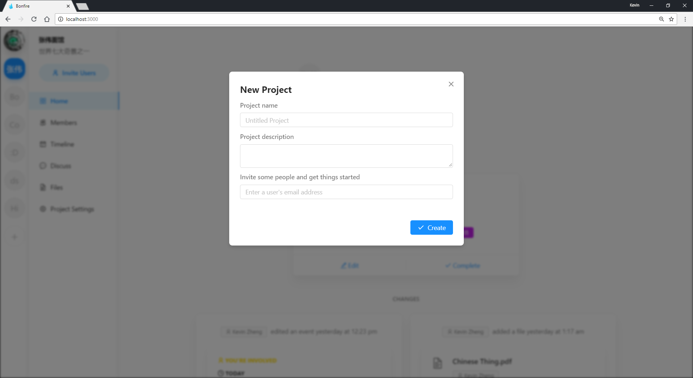
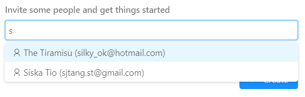
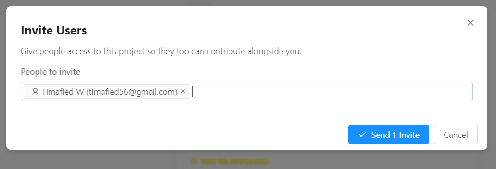
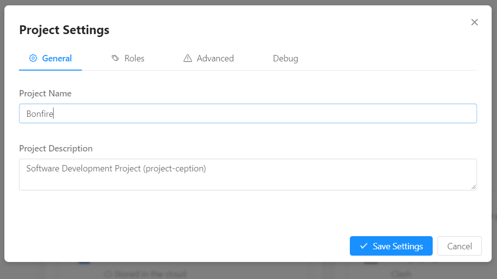
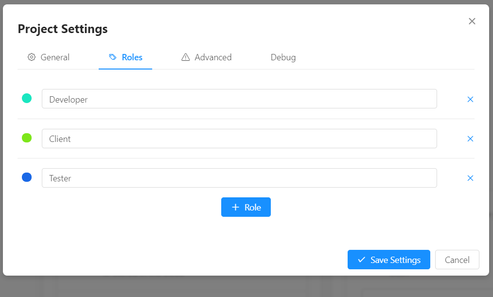

# Validation & Algorithms

## Validation

There are various stages where the user is required to enter data.

> In general, the program aims to prevent invalid data, rather than reject invalid data and prompt the user to reenter once they have submitted. This is known to improve usability and user experience.

### 1 Creation of new projects



#### 1.1 Project name

- Intrinsic properties of the input field is that it only allows text characters (except line breaking characters) to be entered.

- As the user types, the program continuously trims whitespace on the left side of the entered value.

- As the user shifts focus, the program removes surrounding whitespace.

- The program all surrounding whitespace around the project name when it is submitted.

- The program allows input of up to, and including 100 characters, as long as the above is satisfied.

- If the resulting value is empty, "Untitled Project" takes its place.

CreateProject.js

```javascript
<Input
  maxLength={100}
  onChange={e => {
    this.setState({
      projectName: $.string(e.target.value).trimLeft()
    });
  }}
  onBlur={e => {
    this.setState({
      projectName: e.target.value.trim()
    });
  }}
/>
```

Main.js

```javascript
onSubmit={async data => {
  // Set a default name in case the entered project name is empty.
  data.projectName = data.projectName || "Untitled Project";
  ...unrelated code
```

#### 1.2 Project description

- Any text input is allowed, up to and including 2000 characters in length.

CreateEvent.js

```javascript
<Input.TextArea
  maxLength={2000}
  onChange={e => {
    this.setState({
      description: e.target.value
    });
  }}
/>
```

#### 1.3 Invite people

- The user can only choose from a predetermined list of suggestions. All other input is ignored.

- The list of available users is fetched in real time from the database, therefore each option is guaranteed to be a user that exists.



### 2 Invite Users



This component functions exactly like 1.3 Invite People in Create project, submitting is not allowed if the field is empty:

SendInvite.js

```javascript
<Button
  disabled={!this.state.recipients.length}
  ...unrelated code
>
```

### 3 General Project Settings



Both the Project name and Project description fields function the same way as in Create Project. See 1 Create Project for relevant code.

### Role Settings



Each role input field follows the same input restrictions as 1.1 Project name. See that section for relevant code. Instead of replacing empty fields with "Untitled Project", role input fields replace it with "New Role" upon defocus. The user can immediately realise that empty fields are not allowed and can enter a valid value before submission.

RoleEditor.js

```javascript
<Input
  // Trim whitespace on the left or reset the field to "New Role" to ensure the field always contains a valid value.
  onBlur={e => {
    this.setState(
      update(this.state, {
        values: {
          [index]: {
            name: { $set: e.target.value.trim() || "New Role" }
          }
        }
      }),
      () => {
        // Inform the parent component of this change.
        this.props.onChange(this.state.values);
      }
    );
  }}
  ...unrelated code
>
```

#### Change in the latest version

As of the latest version, the app initialises each new field as empty, and upon defocus, replaces the field with "New Role" if left empty.

```javascript
// Add role button
<Button
  type="primary"
  icon="plus"
  onClick={() => {
    this.setState(
      update(this.state, {
        // Initalise field as empty
        values: { $push: [new Role("")] }
      }),
      () => {
        // Focus the new field
        this.inputRefs[this.inputRefs.length - 1].focus();
        this.props.onChange(this.state.values);
      }
    );
  }}
>
  Role
</Button>
```

The blur mechanic remains the same.

### Create Event


## Complex Algorithm

[Asynchronous quicksort](../src/classes/Algorithm.js)
