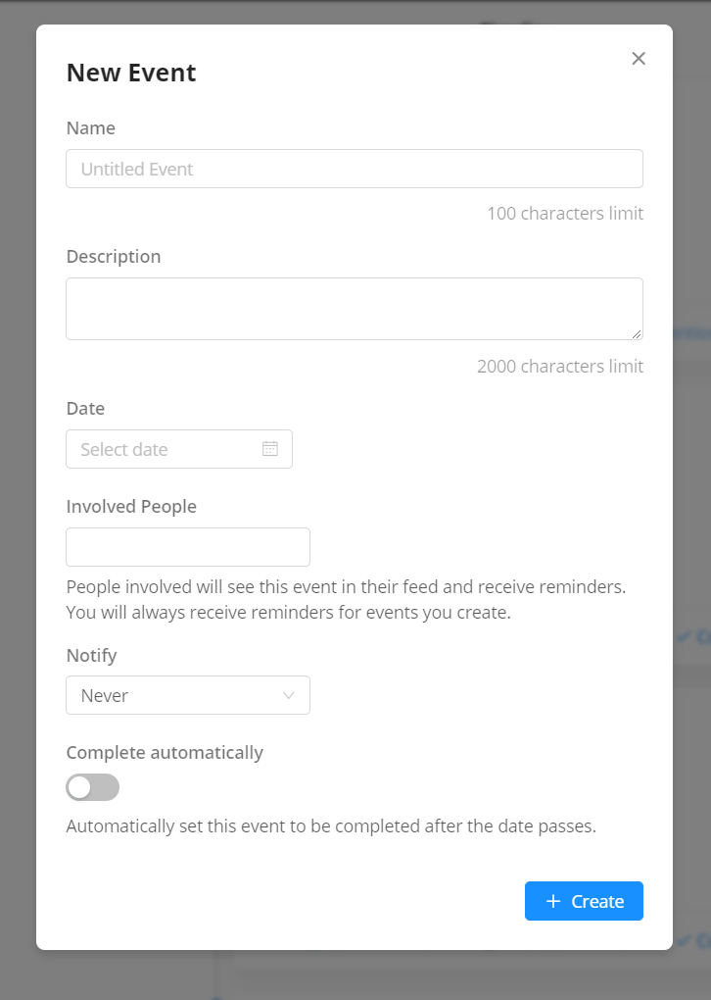
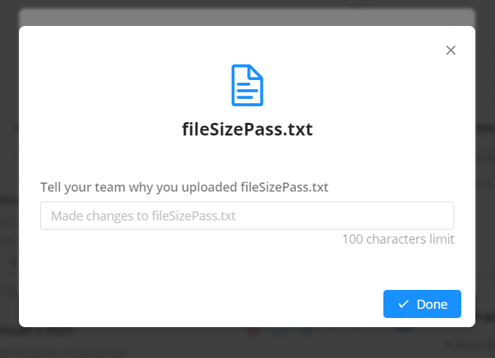

# Validation & Algorithms

## Complex Algorithm

[See the source code of the Asynchronous quicksort](../src/classes/Algorithm.js)

The complex algorithm is an asynchronous quicksort. The quicksort is asynchronous as each time the array is divided, the next recursion can be handled at the same time, increasing performance. The quicksort supports a custom sorting comparator. This means it accepts a function as a parameter which is used to determine how the items are sorted.

For example, (a, b) => a - b will result in a positive number when a is larger, a negative number when b is larger, and 0 when the two are the same.

The will tell the algorithm to place 2 after 1, which is larger.

The algorithm will sort _around_ invalid values, if the comparison fails.

The algorithm will not ever end up with infinite recursion, which is a problem with the built in sorting algorithm, as the number of iterations is determined by array length.

The algorithm is very flexible, and is used in the application primarily for sorting items by date order.

## Validation

There are various stages where the user is required to enter data.

> In general, the program aims to prevent invalid data, rather than reject invalid data and prompt the user to reenter once they have submitted. This is known to improve usability and user experience.

### 1 Creation of new projects


#### 1.1 Project name

- Intrinsic properties of the input field is that it only allows text characters (except line breaking characters) to be entered.

- As the user types, the program continuously trims whitespace on the left side of the entered value.

- As the user shifts focus, the program removes surrounding whitespace.

- The program all surrounding whitespace around the project name when it is submitted.

- The program allows input of up to, and including 100 characters, as long as the above is satisfied.

- If the resulting value is empty, "Untitled Project" takes its place.

CreateProject.js

```javascript
<Input
  maxLength={100}
  onChange={e => {
    this.setState({
      projectName: $.string(e.target.value).trimLeft()
    });
  }}
  onBlur={e => {
    this.setState({
      projectName: e.target.value.trim()
    });
  }}
/>
```

Main.js

```javascript
onSubmit={async data => {
  // Set a default name in case the entered project name is empty.
  data.projectName = data.projectName || "Untitled Project";
  ...unrelated code
```

#### 1.2 Project description

- Any text input is allowed, up to and including 2000 characters in length.

CreateEvent.js

```javascript
<Input.TextArea
  maxLength={2000}
  onChange={e => {
    this.setState({
      description: e.target.value
    });
  }}
/>
```

#### 1.3 Invite people

- The user can only choose from a predetermined list of suggestions. All other input is ignored.

- The list of available users is fetched in real time from the database, therefore each option is guaranteed to be a user that exists.


### 2 Invite Users


This component functions exactly like 1.3 Invite People in Create project, submitting is not allowed if the field is empty:

SendInvite.js

```javascript
<Button
  disabled={!this.state.recipients.length}
  ...unrelated code
>
```

### 3 General Project Settings


Both the Project name and Project description fields function the same way as in Create Project. See 1 Create Project for relevant code.

### Role Settings


Each role input field follows the same input restrictions as 1.1 Project name. See that section for relevant code. Instead of replacing empty fields with "Untitled Project", role input fields replace it with "New Role" upon defocus. The user can immediately realise that empty fields are not allowed and can enter a valid value before submission.

RoleEditor.js

```javascript
<Input
  // Trim whitespace on the left or reset the field to "New Role" to ensure the field always contains a valid value.
  onBlur={e => {
    this.setState(
      update(this.state, {
        values: {
          [index]: {
            name: { $set: e.target.value.trim() || "New Role" }
          }
        }
      }),
      () => {
        // Inform the parent component of this change.
        this.props.onChange(this.state.values);
      }
    );
  }}
  ...unrelated code
>
```

#### Change in the latest version

As of the latest version, the app initialises each new field as empty, and upon defocus, replaces the field with "New Role" if left empty.

```javascript
// Add role button
<Button
  type="primary"
  icon="plus"
  onClick={() => {
    this.setState(
      update(this.state, {
        // Initalise field as empty
        values: { $push: [new Role("")] }
      }),
      () => {
        // Focus the new field
        this.inputRefs[this.inputRefs.length - 1].focus();
        this.props.onChange(this.state.values);
      }
    );
  }}
>
  Role
</Button>
```

The blur mechanic remains the same.

### Create Event



The name and description fields use the same code as the name and description fields in creating a new project. The difference is however, due to performance concerns, the fields do not validate until it is submitted.

The built-in date selector allows selection of only dates, in the format yyyy-mm-dd.

```javascript
<DatePicker
  allowClear={false}
  style={{ marginBottom: 10 }}
  onChange={date => {
    this.setState(
      update(this.state, {
        // Update the state with the numeric value of the selected date
        values: { date: { $set: date.valueOf() } }
      })
    );
  }}
  ref={e => (this.dateField = e)}
/>
```

The people selector allows selection of only people or roles.

The notify field only allows the user to select one of the available options.

The complete automatically switch can only be on or off.

### Upload File



The file uploader allows dragging files into a zone or selecting a file.

File selection using a dialog restricts the user to selecting a file.

```javascript
// Otherwise, if the file size is larger than 50 MB, prevent uplading.
if (file.size > 1024 * 1024 * 50) {
  message.error(`${file.name} is larger than the maximum allowed file size (50 MB).`);
  return;
}
```

There is validation to ensure the file size is less than or equal to 50MB.

There is validation involved to ensure the selected item via drag and dropping is a file, and not a folder.

```javascript
// Test if the file size is a multiple of 4096, since all folders have this property.
if (file.size % 4096 === 0) {
  let reader = new FileReader();
  // If the file has such a size, read the file to check if its a folder. This may take time, which is why the file size check is performed first.
  reader.onload = () => {
    // Otherwise, select the file, and go to the next step.
    this.setState({
      selectedFile: file,
      modalVisible: true,
      loading: false
    });
  };
  reader.onerror = () => {
    message.error("Unfortunately, we currently don't support uploading folders.");
  };
  reader.readAsText(file);
  return;
}
```

If the file uploader is configured to update an existing file, it will check whether the file type matches the source file type.

```javascript
// If the file name is specified, and the extension doesn't match the specified file name's extension, prevent uploading.
if (
  this.state.specifyFileName &&
  this.state.specifyFileName
    .split(".")
    .pop()
    .toLowerCase() !==
    file.name
      .split(".")
      .pop()
      .toLowerCase()
) {
  message.error(
    `We only allow files of the same format to be merged. Instead, you should upload ${file.name} as a separate file.`
  );
  return;
}
```

The description field uses the same validation for project names.
